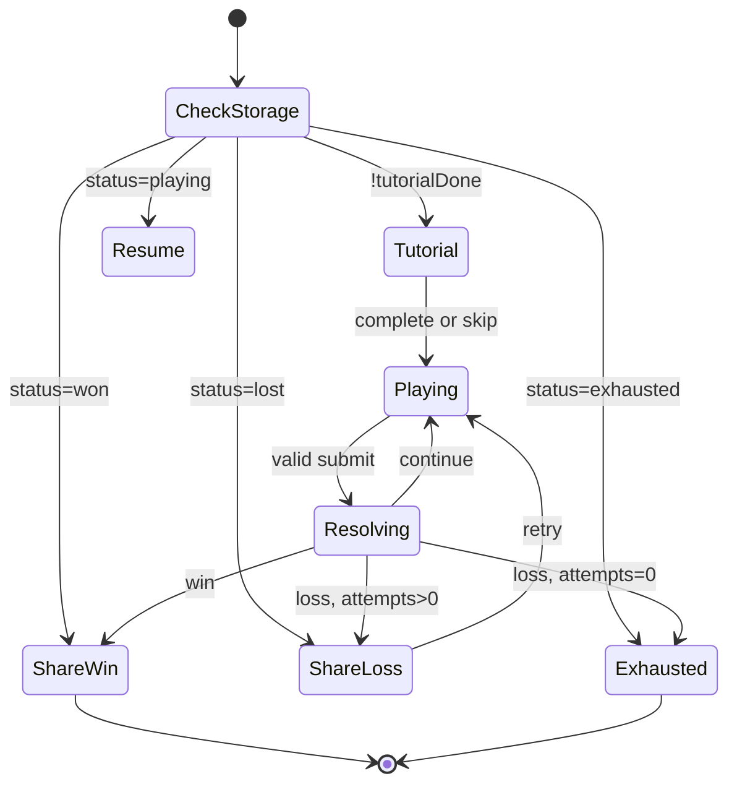

# BattleCode Simulation Mini-Game — Architecture

> **Status:** Specification complete (implementation-ready)  
> **Last updated:** 7 July 2026  
> **Route:** `/simulations`  
> **Implementation plan:** [`IMPLEMENTATION.md`](./IMPLEMENTATION.md) (all new code uses `.tsx`)

This document is the single source of truth for the BattleCode Simulation mini-game: a frontend-only tactical grid game hosted on the BattleCode website to build hype before the event. It does **not** replicate the actual BattleCode competition.

---

## Table of Contents

1. [Product Overview](#1-product-overview)
2. [Goals & Non-Goals](#2-goals--non-goals)
3. [Integration with Existing Codebase](#3-integration-with-existing-codebase)
4. [Routing & Access Control](#4-routing--access-control)
5. [High-Level Architecture](#5-high-level-architecture)
6. [Game Model](#6-game-model)
7. [Turn Resolution Engine](#7-turn-resolution-engine)
8. [Opponent Behavior](#8-opponent-behavior)
9. [Interactive Gameplay Loop](#9-interactive-gameplay-loop)
10. [Player Input & Autocomplete Editor](#10-player-input--autocomplete-editor)
11. [Visual Layer & Animations](#11-visual-layer--animations)
12. [Tutorial](#12-tutorial)
13. [Attempts & Progression](#13-attempts--progression)
14. [Persistence (localStorage)](#14-persistence-localstorage)
15. [Share Cards](#15-share-cards)
16. [Google Analytics](#16-google-analytics)
17. [Simulation Content & Configuration](#17-simulation-content--configuration)
18. [UI Screens & State Machine](#18-ui-screens--state-machine)
19. [File & Folder Structure](#19-file--folder-structure)
20. [Testing Strategy](#20-testing-strategy)
21. [Environment Variables](#21-environment-variables)
22. [Future Work (Out of Scope v1)](#22-future-work-out-of-scope-v1)
23. [Open Items & Content TBD](#23-open-items--content-tbd)

---

## 1. Product Overview

### What it is

- A **frontend-only** mini-game on a **5×5, 6×6, or arbitrary grid** (size is configuration-driven).
- The player controls **one bot** against **one opponent bot** driven by **fixed logical rules** (same behavior for every player).
- Each **cycle**, both bots submit **one instruction** and they resolve **simultaneously**.
- Instructions are BattleCode-themed pseudo-code:
  - `MOVE(UP | DOWN | LEFT | RIGHT)`
  - `ATTACK(UP | DOWN | LEFT | RIGHT)`
  - `SHIELD()`
- **Objective:** reduce the opponent to **0 lives** before the player is eliminated or `maxCycles` is reached.

### How the player plays

This is **not** a batch script editor. The player does **not** write a full program and press Run.

Instead:

1. The game prompts for **one line** of pseudo-code.
2. That line executes **immediately** together with the opponent's instruction for the same cycle.
3. The grid and lives update (with beam animation).
4. If the game continues, the player is prompted for the **next** line.

### Campaign model

- Only **one active simulation** exists at a time (no archive, no simulation picker).
- A new simulation will be released on a schedule (e.g. twice weekly — operational detail outside this doc).
- When the player exhausts all attempts, they see **when the next simulation releases** (configurable date string).

---

## 2. Goals & Non-Goals

### Goals

| Goal             | Detail                                                               |
| ---------------- | -------------------------------------------------------------------- |
| Hype & awareness | Drive repeat visits to the BattleCode site before the event          |
| Shareability     | Win/loss share cards for Instagram Stories (download + native share) |
| Fairness         | Every player faces the same map, spawns, and opponent logic          |
| Low friction     | No authentication required                                           |
| Mobile reach     | Playable on mobile for landing page and `/simulations`               |
| Analytics        | GA4 on the entire site, with simulation-specific events              |
| Resume play      | Full game state survives page refresh via localStorage               |

### Non-Goals (v1)

| Non-Goal                   | Notes                                             |
| -------------------------- | ------------------------------------------------- |
| Replicate real BattleCode  | Simplified mechanics by design                    |
| Backend / server state     | Everything client-side                            |
| Authentication             | No Supabase session required to play              |
| Archive / past simulations | One active simulation only                        |
| Commander dialogue         | Static character placeholder only; dialogue later |
| Registration CTA           | Added later; v1 CTA is share result               |
| Practice mode              | No free retries without consuming context         |
| Landing page link to game  | Route exists; button added later                  |

---

## 3. Integration with Existing Codebase

### Tech stack (existing)

| Layer                 | Technology                                        |
| --------------------- | ------------------------------------------------- |
| Framework             | Next.js 16 (App Router), React 19, TypeScript     |
| Styling               | Tailwind CSS 4, custom utilities in `globals.css` |
| Auth (elsewhere)      | Supabase — **not used by simulation**             |
| Real-time (elsewhere) | Socket.IO — **not used by simulation**            |

### Visual language to reuse

- Fonts: **Orbitron** (headings), **Oxanium** (body)
- Utilities: `glass-box`, orange/amber gradients, `gradient-border-button`, dark HUD aesthetic
- Assets: BattleCode logo for share cards (path TBD — see [§23](#23-open-items--content-tbd))

### Mobile gate change

`MobileOnly.tsx` currently blocks the entire app on mobile user agents.

**Required change:** allow mobile access only on:

- `/` (landing page)
- `/simulations`

All other routes (`/dashboard`, `/r0`–`/r3`, etc.) remain **laptop-only**.

---

## 4. Routing & Access Control

| Route            | Auth                | Mobile | Purpose                         |
| ---------------- | ------------------- | ------ | ------------------------------- |
| `/simulations`   | None                | Yes    | Mini-game                       |
| `/`              | Optional (existing) | Yes    | Landing (game link added later) |
| All other routes | Yes (existing)      | No     | Competition platform            |

### Route implementation

```
src/app/simulations/page.tsx
```

- Client component entry point.
- Mounts `<SimulationGame />`.
- No middleware auth checks for this path.
- No dependency on `AuthContext`, `SocketContext`, or backend APIs.

---

## 5. High-Level Architecture

```
┌─────────────────────────────────────────────────────────────────┐
│                     /simulations (React UI)                      │
│  TutorialOverlay │ GridBoard │ TurnInput │ ShareCard │ HUD      │
└────────────────────────────┬────────────────────────────────────┘
                             │
         ┌───────────────────┼───────────────────┐
         ▼                   ▼                   ▼
┌─────────────────┐ ┌───────────────┐ ┌─────────────────┐
│  Game Engine    │ │  localStorage │ │  GA4 (gtag)     │
│  (pure TS)      │ │  (sim cache)  │ │  analytics.tsx  │
└────────┬────────┘ └───────────────┘ └─────────────────┘
         │
         ▼
┌─────────────────┐
│ Simulation      │
│ Config (static) │
└─────────────────┘
```

### Layer responsibilities

| Layer                 | Responsibility                                           | React?            |
| --------------------- | -------------------------------------------------------- | ----------------- |
| **Engine**            | Grid, bots, turn resolution, opponent AI, win/loss       | No                |
| **Simulation config** | Map, spawns, dates, maxCycles                            | No                |
| **Storage**           | Cache of per-simulation saves in localStorage            | Hook wrapper only |
| **UI**                | State machine, rendering, input, animation, share canvas | Yes               |
| **Analytics**         | Thin event wrapper                                       | Yes               |

**Critical rule:** all game rules live in pure TypeScript under `src/game/engine/`. The UI calls `step(state, playerInstruction)` and renders the returned trace. This keeps rules testable and separate from React.

**File convention:** all new simulation code uses **`.tsx`** (including engine/storage modules with no JSX) — no standalone `.ts` files for this feature.

---

## 6. Game Model

### Coordinate system

- Grid is a **2D array:** `grid[row][col]`
- **Row 0** is the **top** of the grid.
- **Col 0** is the **left** of the grid.
- Bot position: `{ row: number; col: number }`

### Tile types

Only two tile types exist:

```typescript
type Tile = "EMPTY" | "WALL";
type Grid = Tile[][];
```

No other tile types (no hazards, no spawn markers as tile types — spawn positions are config fields).

### Grid size

- **Not fixed** to 5×5 or 6×6.
- Rows and columns are defined by the active simulation config.
- All engine helpers must use `grid.length` and `grid[0].length` (or stored dimensions) — no hardcoded size.

### Bot model

```typescript
type BotId = "player" | "opponent";

interface Bot {
  id: BotId;
  row: number;
  col: number;
  lives: 0 | 1 | 2;
  shieldActive: boolean; // true only for the current cycle; cleared after resolve
}
```

- Both bots start with **2 lives**.
- `shieldActive` is set during the Shield phase and cleared in Cleanup (never persists across cycles in state).

### Instructions

```typescript
type Direction = "UP" | "DOWN" | "LEFT" | "RIGHT";

type Instruction =
  | { type: "MOVE"; direction: Direction }
  | { type: "ATTACK"; direction: Direction }
  | { type: "SHIELD" };
```

**Display / input strings** (canonical pseudo-code):

| Instruction | Syntax                                                     |
| ----------- | ---------------------------------------------------------- |
| Move        | `MOVE(UP)` `MOVE(DOWN)` `MOVE(LEFT)` `MOVE(RIGHT)`         |
| Attack      | `ATTACK(UP)` `ATTACK(DOWN)` `ATTACK(LEFT)` `ATTACK(RIGHT)` |
| Shield      | `SHIELD()`                                                 |

The parser accepts only these exact enum forms. No free-form code execution.

---

## 7. Turn Resolution Engine

### Simultaneous execution

Each **cycle**, the player submits one instruction and the opponent submits one instruction (from **logical hardcoded AI**). Both resolve **in the same cycle** — not chess-style alternating half-turns.

### Resolution order (fixed, deterministic)

Every cycle runs these phases **in order**:

```
1. Shield phase
2. Move phase
3. Attack phase
4. Cleanup phase
5. Terminal check
```

#### Phase 1 — Shield

- If a bot's instruction is `SHIELD()`, set `bot.shieldActive = true` for this cycle.
- `MOVE` and `ATTACK` do not set shield.

#### Phase 2 — Move

- Applies to bots whose instruction is `MOVE(direction)`.
- Each bot moves **exactly one cell** in that direction.
- **Wall:** if the target cell is `WALL` or out of bounds → that bot does not move.
- **Collision:** if both bots would enter the **same cell** → **neither moves**.
- **Swap collision (recommended):** if both bots would swap positions → **neither moves** (same outcome as collision; implement for consistency).
- Bots with `ATTACK` or `SHIELD` do not move.

#### Phase 3 — Attack

Beam attacks fire along a full **row** or **column** from the attacking bot.

| Direction        | Beam path                                                                  |
| ---------------- | -------------------------------------------------------------------------- |
| `LEFT` / `RIGHT` | Entire **row** at `bot.row`, from adjacent cell outward until grid edge    |
| `UP` / `DOWN`    | Entire **column** at `bot.col`, from adjacent cell outward until grid edge |

**Beam rules:**

| Rule               | Behavior                                                                                   |
| ------------------ | ------------------------------------------------------------------------------------------ |
| Wall blocking      | Beam **stops at the first `WALL`**. No damage to cells beyond the wall.                    |
| Self-damage        | **Never.** The source bot is not hit by its own beam.                                      |
| Targets            | Only the **opponent bot** can be damaged (two bots on the grid).                           |
| Damage             | **1 life** lost per hit.                                                                   |
| Multiple hits      | At most **one** damage event per bot per beam (only two bots exist).                       |
| Shield             | If target has `shieldActive === true` → **no life loss** from that beam hit.               |
| Simultaneous beams | Both bots may `ATTACK` in the same cycle; resolve both independently using the same rules. |

#### Phase 4 — Cleanup

- Set `shieldActive = false` on **both** bots.
- Increment `cycle` by 1.

#### Phase 5 — Terminal check

| Outcome            | Condition                                          |
| ------------------ | -------------------------------------------------- |
| **Win**            | Opponent `lives === 0`                             |
| **Loss**           | Player `lives === 0`                               |
| **Loss (timeout)** | `cycle >= maxCycles` and neither win condition met |
| **Continue**       | Both alive and `cycle < maxCycles`                 |

**Priority if multiple could apply in one cycle:** evaluate after all damage is applied.

> **Locked rule:** if both bots reach 0 lives in the same cycle → **player loss** (player must eliminate the opponent, not trade). Covered in engine tests.

### maxCycles

- Configurable per simulation.
- **Placeholder default: `50`** until playtesting tunes it.
- Prevents infinite stalemates when opponent and player repeat patterns.

---

## 8. Opponent Behavior

The opponent uses **pure logical hardcoding from cycle 1** — no per-simulation move script. The same rules run every cycle for every player. Difficulty comes from **map layout and spawn positions**, not hand-authored opponent sequences.

The opponent does **not** read the player's input for the current cycle. It decides from the **game state at the start of the cycle** (before move/attack resolve).

### Decision tree (every cycle)

```
if player can be hit by a beam (same row or column, walls respected):
  ATTACK(direction toward player)
else:
  MOVE(one step toward player)
```

### When the opponent attacks

Attack **only** when the player is **aligned** on the same row or same column and a beam would reach them (no wall blocking between opponent and player along that line).

| Alignment                     | Direction       |
| ----------------------------- | --------------- |
| Same row, player to the right | `ATTACK(RIGHT)` |
| Same row, player to the left  | `ATTACK(LEFT)`  |
| Same column, player below     | `ATTACK(DOWN)`  |
| Same column, player above     | `ATTACK(UP)`    |

If both row and column alignment are possible (player shares row **and** column — same cell or impossible unless same cell), use **row first** (horizontal attack) as a fixed tie-break.

The opponent **never** uses `SHIELD()` unless added as explicit logic later (not in v1).

### When the opponent moves

One **Manhattan** step toward the player:

1. Prefer reducing **row distance** if `|Δrow| >= |Δcol|`.
2. Otherwise prefer reducing **col distance**.
3. If the preferred direction is blocked (wall, out of bounds, or would collide with player cell — opponent moves adjacent, not onto player) → try the other axis toward the player.
4. If still blocked → try any legal `MOVE` that reduces Manhattan distance.
5. If completely stuck → `SHIELD()` as last resort (optional v1 fallback) or no-op idle — **recommend `SHIELD()`** when no legal move exists to avoid engine errors.

> **Tie-break is fully deterministic** — no randomness. Same state always yields the same opponent instruction.

### Implementation

```typescript
// src/game/engine/opponent.tsx
function chooseOpponentInstruction(state: GameState): Instruction;
```

---

## 9. Interactive Gameplay Loop

### Flow (live, turn-by-turn)

```
Tutorial (skippable)
    ↓
Playing — cycle N
    ↓
Player types one valid instruction → Enter
    ↓
Opponent instruction chosen via logical AI (`chooseOpponentInstruction`)
    ↓
Engine resolves cycle (with beam animation in UI)
    ↓
Persist active simulation via `saveSimulation(currentId, state)`
    ↓
Win?  → Win share screen
Loss? → Decrement attempts if loss → Loss share or Exhausted
Else  → Prompt for cycle N+1
```

### What the player cannot do

- Write multiple cycles ahead in one submission.
- Edit or undo a previous cycle.
- Practice run without attempt consequences (no practice mode).
- Replay after win (terminal win state).
- Start a new run after attempts exhausted.

### Instant result

- No separate "Run simulation" button.
- The **last move of the winning/losing cycle** resolves and immediately transitions to the outcome screen (after animation completes).

---

## 10. Player Input & Autocomplete Editor

### UX requirements

- **Typed pseudo-code**, one line per cycle.
- **Enum-only** — invalid tokens cannot be submitted.
- **Autocomplete like a code editor**, not a classic clickable dropdown:
  - **Inline suggestions** appear as the user types (ghost text / suggestion list overlaid on the input).
  - **Tab** or **Enter** accepts the highlighted suggestion.
  - User cannot pick from a detached `<select>`.
- **Mobile:** same keyboard-driven input with **inline autocomplete** (not a separate tap-only picker). Suggestions render inline above or within the input area; mobile keyboard submits via Enter when the line is valid.
- Show current cycle number, player lives, opponent lives in HUD.

### Valid suggestion tree (conceptual)

```
MOVE(          → UP | DOWN | LEFT | RIGHT
ATTACK(        → UP | DOWN | LEFT | RIGHT
SHIELD(        → )
```

Only complete valid lines are submittable, e.g. `MOVE(UP)`, `ATTACK(RIGHT)`, `SHIELD()`.

### Recommended implementation

**Monaco Editor** (already in repo via `@monaco-editor/react`):

- Single-line mode (or short height).
- Custom language + completion provider for the three instruction families.
- `Enter` submits when line is valid; `Tab` accepts completion.

Alternative: custom `input` + overlay ghost text (more work for same UX).

### Parser

```typescript
function parseInstruction(input: string): Instruction | null;
```

- Trim whitespace.
- Strict match against allowed enum strings.
- Return `null` if invalid — UI disables submit.

---

## 11. Visual Layer & Animations

### GridBoard

- Renders `grid[row][col]` as a CSS Grid or table of cells.
- **EMPTY:** open cell.
- **WALL:** distinct visual (block/obstacle).
- **Bots:** player and opponent markers on top of cells (different colors/sprites).
- **Lives:** HUD hearts (♥) or numeric `2 / 1 / 0`.

### Beam animation

When `ATTACK` resolves:

1. Highlight all cells along the beam path (row or column from attacker).
2. Stop highlight at wall (cells beyond wall not highlighted).
3. Duration: **~400–600ms** (implementation default).
4. After animation: apply life changes and bot death visuals if applicable.

Animation state is **UI-only**; persisted state updates **after** animation completes so reload matches what the user saw.

### Static commander (v1)

- Placeholder component (`StaticCommander.tsx`) — sprite or styled div.
- **No dialogue** in v1.
- Reserved screen region for future commander intro.

### Mobile layout

- **Portrait:** grid on top, HUD + input below.
- Touch-friendly input area; inline autocomplete suggestions visible while the mobile keyboard is open.
- **Tab** may be absent on some mobile keyboards — **Enter** accepts the active inline suggestion when the line is valid.

### Responsive grid

- Cell size scales to container width.
- Works for arbitrary grid dimensions from config.

---

## 12. Tutorial

### Behavior

- Shown on **first visit** (unless previously completed or skipped).
- **Skippable** at any time.
- Completion or skip sets `tutorialDone: true` in localStorage.

### Content (structure)

Interactive steps explaining:

1. Grid and objective (eliminate opponent).
2. `MOVE` — one cell per cycle.
3. `ATTACK` — beam along full row/column; stops at walls.
4. `SHIELD` — blocks beam damage for one cycle.
5. Simultaneous turns — you and opponent act each cycle.
6. How to use autocomplete input (type, Tab/Enter).

**Step copy and mini-scenarios:** content TBD (see [§23](#23-open-items--content-tbd)).

---

## 13. Attempts & Progression

| Rule                          | Value                                                             |
| ----------------------------- | ----------------------------------------------------------------- |
| Starting attempts             | **2** per active simulation                                       |
| Attempt consumed              | **On loss only** (player dies or `maxCycles` timeout)             |
| Win                           | Does not consume attempts; sets `status: "won"`                   |
| After loss with attempts left | Show loss share screen → player can retry (new run from start)    |
| After loss with 0 attempts    | `status: "exhausted"` — **share only**, show next simulation date |
| Practice mode                 | **None**                                                          |

### New run after loss (retry)

- Resets in-memory game state to simulation initial config.
- **Decrement** for loss already applied.
- Persists immediately.

---

## 14. Persistence (localStorage)

### Design principles

- **No authentication** — localStorage is the source of truth.
- **Cache-based storage** — each simulation is its own save file, keyed by simulation ID.
- **Do not reset on refresh** — the active simulation's save restores exactly.
- **No migration on new releases** — a new simulation ID simply has no save yet; create a fresh one on first visit.
- Old simulation saves may remain in storage (optional cleanup later).

### Storage model

One root object in localStorage acts as a **cache of simulation states**. The game only ever **loads and saves the currently active simulation ID**; other entries are inert until archive/replay is built.

```
battlecode_sim_v1   →   RootStorage
```

### Schema

```typescript
/** Root blob — single localStorage key */
interface RootStorage {
  version: 1;
  tutorialDone: boolean;
  simulations: Record<string, SimulationSave>; // key = sim id, e.g. "sim-001"
}

/** Per-simulation save file */
interface SimulationSave {
  attemptsRemaining: number; // 0 | 1 | 2
  status: "playing" | "won" | "lost" | "exhausted";

  // Live game (full state for mid-game resume)
  cycle: number;
  player: Bot;
  opponent: Bot;
  grid: Grid;

  // Terminal / share
  cyclesToWin?: number;
  playerLivesRemaining?: number;
}
```

**Example:**

```json
{
  "version": 1,
  "tutorialDone": true,
  "simulations": {
    "sim-001": {
      "attemptsRemaining": 0,
      "status": "exhausted",
      "cycle": 12,
      "...": "..."
    },
    "sim-002": {
      "attemptsRemaining": 2,
      "status": "playing",
      "cycle": 3,
      "...": "..."
    }
  }
}
```

Include a root `version` field for **schema reshaping only** (not per-simulation migration).

### Storage API

Three functions — implemented in `src/game/storage/simulationStorage.tsx`:

```typescript
function loadSimulation(id: string): SimulationSave | null;

function saveSimulation(id: string, state: SimulationSave): void;

function deleteSimulation(id: string): void;
```

Helpers (same module):

```typescript
function loadRoot(): RootStorage;
function saveRoot(root: RootStorage): void;
function getTutorialDone(): boolean;
function setTutorialDone(done: boolean): void;
```

### Startup flow

On `/simulations` mount:

```mermaid
flowchart TD
    A[Read RootStorage from localStorage] --> B[currentId = ACTIVE_SIMULATION.id]
    B --> C{simulations[currentId] exists?}
    C -->|Yes| D[loadSimulation currentId → resume]
    C -->|No| E[createFreshSimulationSave → saveSimulation]
    D --> F[Render UI from status]
    E --> F
```

1. Determine **current simulation ID** from config (`ACTIVE_SIMULATION.id`).
2. `loadSimulation(currentId)`.
3. If **null** → create fresh save (2 attempts, initial grid/bots, `status: "playing"`) and `saveSimulation`.
4. If **exists** → resume from stored state.

**New simulation release:** deploy a new `ACTIVE_SIMULATION.id`. No reset logic — the new ID has no cache entry, so step 3 runs automatically. Previous sim saves remain under their old keys.

### When to write

| Event                                | Action                                                   |
| ------------------------------------ | -------------------------------------------------------- |
| Tutorial complete/skip               | Update root `tutorialDone`                               |
| Each cycle after animation + resolve | `saveSimulation(currentId, state)`                       |
| Win / loss / exhausted               | `saveSimulation` with terminal status                    |
| New retry after loss                 | `saveSimulation` with fresh run fields, same `currentId` |

### Reload behavior

Uses the save for **current simulation ID only**:

| `status`    | UI on load                                            |
| ----------- | ----------------------------------------------------- |
| `playing`   | Resume at exact cycle, positions, lives, input prompt |
| `won`       | Win share card                                        |
| `lost`      | Loss share card with retry if `attemptsRemaining > 0` |
| `exhausted` | Exhausted view — share only + next date               |

### Optional cleanup

Not required for v1. Later:

- `deleteSimulation(oldId)` when pruning the cache.
- Or drop entries older than N releases.

Old saves do not affect the active game.

---

## 15. Share Cards

### Generation

- Render off-screen **HTML canvas** (or canvas API) → PNG blob.
- Two actions: **Download** and **Share**.

### Share mechanism

| Method       | Detail                                                                                                                |
| ------------ | --------------------------------------------------------------------------------------------------------------------- |
| **Download** | Trigger browser download of PNG                                                                                       |
| **Share**    | [Web Share API](https://developer.mozilla.org/en-US/docs/Web/API/Navigator/share) with `files: [png]` where supported |
| **Fallback** | Download + brief hint: "Open Instagram → Your Story → upload saved image"                                             |

There is **no** direct Instagram Stories API from web.

### Win card content

| Element  | Content                                                           |
| -------- | ----------------------------------------------------------------- |
| Logo     | BattleCode logo                                                   |
| Headline | **"I beat the robot in X moves"** (`X` = `cyclesToWin`)           |
| Stats    | Player hearts remaining                                           |
| Footer   | **"BattleCode on 19th September"** (from `shareEventDate` config) |

### Loss card content (generic)

| Element  | Content                                                           |
| -------- | ----------------------------------------------------------------- |
| Logo     | BattleCode logo                                                   |
| Headline | **"I battled the BattleCode bot"**                                |
| Subline  | **"Think you can do better?"**                                    |
| Footer   | **"BattleCode on 19th September"** (from `shareEventDate` config) |

### When share is shown

| Scenario               | Share variant                                 |
| ---------------------- | --------------------------------------------- |
| Win                    | Win card                                      |
| Loss (attempts remain) | Loss card — can retry after                   |
| Loss (exhausted)       | Loss card — **only** share/download, no retry |
| Win on reload          | Win card again                                |

---

## 16. Google Analytics

### Scope

GA4 on the **entire website** (root layout), not only `/simulations`.

### Setup

1. Create GA4 property (external — Google Analytics console).
2. Set environment variable:

```
NEXT_PUBLIC_GA_MEASUREMENT_ID=G-XXXXXXXXXX
```

3. Load gtag in `src/app/layout.tsx` via `next/script`.
4. Wrap calls in `src/lib/analytics.tsx`.

### Simulation events

| Event name               | Trigger                                                          |
| ------------------------ | ---------------------------------------------------------------- |
| `sim_page_view`          | `/simulations` mount                                             |
| `sim_tutorial_complete`  | Tutorial finished                                                |
| `sim_tutorial_skip`      | Tutorial skipped                                                 |
| `sim_cycle_submit`       | Player submits valid instruction (optional: include cycle index) |
| `sim_win`                | Player wins                                                      |
| `sim_loss`               | Player loses                                                     |
| `sim_attempts_exhausted` | Attempts hit 0                                                   |
| `sim_share_download`     | Download clicked                                                 |
| `sim_share_native`       | Web Share API invoked                                            |

### Site-wide events (recommended baseline)

| Event name  | Trigger                   |
| ----------- | ------------------------- |
| `page_view` | Automatic via gtag config |

---

## 17. Simulation Content & Configuration

### Single active simulation

```typescript
// src/game/simulations/active.tsx
export const ACTIVE_SIMULATION: SimulationConfig = { ... };
```

Only one config is exported at a time. The **`id` field is the localStorage cache key** — `loadSimulation(ACTIVE_SIMULATION.id)`. Deploying a new simulation = new `id` in config + redeploy; players without a save for that id start fresh automatically.

### Config interface

```typescript
interface SimulationConfig {
  id: string; // e.g. "sim-001"
  grid: Grid;
  playerStart: { row: number; col: number };
  opponentStart: { row: number; col: number };
  maxCycles: number; // default 50 until tuned
  nextSimulationDate: string; // shown when exhausted, e.g. "19th September"
  shareEventDate: string; // on share cards, e.g. "19th September"
}
```

### Validation (at load time)

Engine or config loader should assert:

- Spawns are in bounds and on `EMPTY` cells.
- Spawns are not on the same cell.
- Grid is rectangular (all rows same length).

---

## 18. UI Screens & State Machine



### Component map

| Component             | Role                           |
| --------------------- | ------------------------------ |
| `SimulationGame.tsx`  | Top-level state machine        |
| `TutorialOverlay.tsx` | Skippable tutorial             |
| `GridBoard.tsx`       | Grid + bots + beam animation   |
| `TurnInput.tsx`       | Autocomplete pseudo-code input |
| `LivesHud.tsx`        | Lives + cycle counter          |
| `StaticCommander.tsx` | Placeholder art                |
| `ShareCard.tsx`       | Canvas card + Download / Share |
| `ExhaustedView.tsx`   | Share + `nextSimulationDate`   |

---

## 19. File & Folder Structure

```
src/
├── app/
│   ├── layout.tsx                      # + GA4 Script
│   └── simulations/
│       └── page.tsx
├── game/
│   ├── engine/
│   │   ├── types.tsx
│   │   ├── grid.tsx                     # bounds, getCell, isWalkable
│   │   ├── parser.tsx                   # string → Instruction
│   │   ├── beam.tsx                     # path cells, wall stop, damage
│   │   ├── resolver.tsx                 # one full cycle resolve
│   │   ├── opponent.tsx                 # logical hardcoded AI
│   │   └── runner.tsx                   # createInitialState, step()
│   ├── simulations/
│   │   ├── active.tsx                   # ACTIVE_SIMULATION config
│   │   └── index.tsx
│   └── storage/
│       └── simulationStorage.tsx        # loadSimulation, saveSimulation, deleteSimulation
├── components/
│   └── simulation/
│       ├── SimulationGame.tsx
│       ├── TutorialOverlay.tsx
│       ├── GridBoard.tsx
│       ├── TurnInput.tsx
│       ├── LivesHud.tsx
│       ├── StaticCommander.tsx
│       ├── ShareCard.tsx
│       └── ExhaustedView.tsx
└── lib/
    └── analytics.tsx
```

### Engine public API (suggested)

```typescript
function createInitialState(config: SimulationConfig): GameState;

function step(
  state: GameState,
  playerInstruction: Instruction,
  config: SimulationConfig,
): {
  nextState: GameState;
  opponentInstruction: Instruction;
  beamPaths: { attacker: BotId; cells: { row; col }[] }[];
  events: GameEvent[];
  outcome: "continue" | "win" | "loss";
};
```

---

## 20. Testing Strategy

### Unit tests (engine)

| Test area             | Cases                                                             |
| --------------------- | ----------------------------------------------------------------- |
| **Beam**              | Stops at wall; no through damage; no self-hit                     |
| **Shield**            | Blocks 1 beam hit for that cycle                                  |
| **Move**              | Wall block; mutual collision → no move                            |
| **Lives**             | 2 → 1 → 0 elimination                                             |
| **maxCycles**         | Timeout → loss at cycle 50                                        |
| **Opponent AI**       | Attacks toward player when aligned; moves toward player otherwise |
| **Determinism**       | Same board state → same opponent move (no RNG)                    |
| **Simultaneous kill** | Both die same cycle → player loss (documented rule)               |

### Golden tests

Fixed `ACTIVE_SIMULATION` + fixed player input sequence → expected trace of positions, lives, outcome.

### Manual QA checklist

- [ ] Refresh mid-game restores state for active simulation ID
- [ ] **New simulation ID:** no save for new id → fresh 2 attempts; old id entries remain in cache
- [ ] Loss decrements attempts; win does not
- [ ] Exhausted blocks retry, shows next date
- [ ] Share download works desktop + mobile
- [ ] Web Share on supported mobile browsers
- [ ] Mobile layout on `/simulations`
- [ ] Landing `/` still works on mobile
- [ ] Dashboard still blocked on mobile
- [ ] GA events fire in DebugView

---

## 21. Environment Variables

| Variable                        | Required            | Purpose                |
| ------------------------------- | ------------------- | ---------------------- |
| `NEXT_PUBLIC_GA_MEASUREMENT_ID` | Yes (for analytics) | GA4 measurement ID     |
| Existing Supabase/Socket vars   | Unchanged           | Not used by simulation |

---

## 22. Future Work (Out of Scope v1)

- Landing page button → `/simulations`
- Registration CTA on homepage / simulation page
- Commander dialogue and intro narrative
- Multiple simulations / archive route `/simulations/[id]` (cache already stores per-id saves)
- Backend leaderboard or attempt verification
- Sound effects and advanced particle effects
- Social meta tags (OG image per share)

---

## 23. Open Items & Content TBD

These do **not** block engine or shell implementation but need content before ship:

| Item                              | Owner / Notes                               |
| --------------------------------- | ------------------------------------------- |
| **First simulation map**          | Grid layout, walls, spawn positions         |
| **Tutorial step copy**            | Exact text and optional mini-demo states    |
| **BattleCode logo asset path**    | For share card canvas (`public/...`)        |
| **Static commander sprite**       | Art asset or placeholder graphic            |
| **GA4 Measurement ID**            | From Google Analytics console               |
| **Exact share event date string** | Config field — currently `"19th September"` |

### Confirmed product decisions (locked)

| Decision                        | Resolution                                                                                                         |
| ------------------------------- | ------------------------------------------------------------------------------------------------------------------ |
| Simultaneous mutual elimination | Both bots die same cycle → **player loss**                                                                         |
| Mobile autocomplete             | Keyboard input + **inline** suggestions (Tab/Enter to accept)                                                      |
| New simulation deploy           | New `ACTIVE_SIMULATION.id` → no save exists → fresh run; `tutorialDone` at root unchanged; old saves kept in cache |
| Opponent AI                     | **Pure logic from cycle 1** — attack toward player when hittable, else move toward player; fully deterministic     |

---

## Appendix A — Instruction Reference Card

```
┌──────────────────────────────────────────────────────────┐
│  MOVE(dir)     Move 1 cell. dir ∈ UP DOWN LEFT RIGHT     │
│  ATTACK(dir)   Beam entire row/col until wall or edge    │
│  SHIELD()      Block beam damage this cycle              │
│                                                          │
│  Each cycle: you + opponent act simultaneously         │
│  Lives: 2 each │ Attempts: 2 (lost on defeat only)      │
└──────────────────────────────────────────────────────────┘
```

---

## Appendix B — Example Cycle Trace

**Setup:** 5×5 grid, player at (2,1), opponent at (2,3), no walls between.

| Cycle | Player          | Opponent       | Result                                 |
| ----- | --------------- | -------------- | -------------------------------------- |
| 1     | `SHIELD()`      | `ATTACK(LEFT)` | Player shield blocks beam              |
| 2     | `ATTACK(RIGHT)` | `MOVE(LEFT)`   | Beam hits opponent, opponent 2→1 lives |
| 3     | ...             | ...            | ...                                    |

(Exact trace depends on active simulation config.)

---

_End of architecture document._
