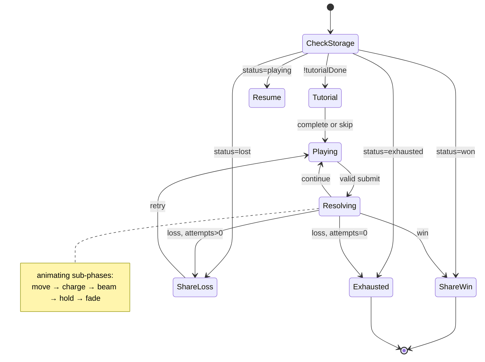

# BattleCode Simulation Mini-Game — Architecture

> **Status:** v1 shipped; **v2 mechanics specified** (click-based input + attack/shield cooldowns) — implementation pending  
> **Last updated:** 10 July 2026  
> **Route:** `/simulations`  
> **Implementation plan:** [`IMPLEMENTATION.md`](./IMPLEMENTATION.md) (all new code uses `.tsx`)

This document is the single source of truth for the BattleCode Simulation mini-game: a frontend-only tactical grid game hosted on the BattleCode website to build hype before the event. It does **not** replicate the actual BattleCode competition.

---

## Table of Contents

1. [Product Overview](#1-product-overview)
2. [Goals & Non-Goals](#2-goals--non-goals)
3. [Integration with Existing Codebase](#3-integration-with-existing-codebase)
4. [Routing & Access Control](#4-routing--access-control)
5. [High-Level Architecture](#5-high-level-architecture)
6. [Game Model](#6-game-model)
7. [Turn Resolution Engine](#7-turn-resolution-engine)
8. [Opponent Behavior](#8-opponent-behavior)
9. [Interactive Gameplay Loop](#9-interactive-gameplay-loop)
10. [Player Input — Click-Based Actions](#10-player-input--click-based-actions)
11. [Visual Layer & Animations](#11-visual-layer--animations)
12. [Tutorial](#12-tutorial)
13. [Attempts & Progression](#13-attempts--progression)
14. [Persistence (localStorage)](#14-persistence-localstorage)
15. [Share Cards](#15-share-cards)
16. [Google Analytics](#16-google-analytics)
17. [Simulation Content & Configuration](#17-simulation-content--configuration)
18. [UI Screens & State Machine](#18-ui-screens--state-machine)
19. [File & Folder Structure](#19-file--folder-structure)
20. [Testing Strategy](#20-testing-strategy)
21. [Environment Variables](#21-environment-variables)
22. [Future Work (Out of Scope v1)](#22-future-work-out-of-scope-v1)
23. [Open Items & Content TBD](#23-open-items--content-tbd)
24. [Implementation Status (v1 snapshot)](#24-implementation-status-v1-snapshot)

---

## 1. Product Overview

### What it is

- A **frontend-only** mini-game on a **5×5, 6×6, or arbitrary grid** (size is configuration-driven).
- The player controls **one bot** against **one opponent bot** driven by **fixed logical rules** (same behavior for every player).
- Each **cycle**, both bots submit **one instruction** and they resolve **simultaneously**.
- Instructions are BattleCode-themed pseudo-code:
  - `MOVE(UP | DOWN | LEFT | RIGHT)`
  - `ATTACK(UP | DOWN | LEFT | RIGHT)`
  - `SHIELD()`
- **Objective:** reduce the opponent to **0 lives** before the player is eliminated or `maxCycles` is reached.

### How the player plays

This is **not** a batch script editor. The player does **not** write a full program and press Run.

Instead ( **v2 — click-based** ):

1. Each cycle, the player picks an **action** with side buttons: **Move**, **Attack**, or **Shield**.
2. For **Move** and **Attack**, the player **clicks a grid cell** to preview the action (highlighted path or destination).
3. **Shield** is confirmed from the button alone (no target cell).
4. The player presses **Submit** to lock in the instruction for that cycle.
5. The opponent acts simultaneously (same rules, including cooldowns).
6. The grid animates and lives update; if the game continues, the next cycle begins.

> **v1 (deprecated):** typed pseudo-code one-liner with Monaco autocomplete. Replaced by click-based input in v2 — see [§10](#10-player-input--click-based-actions).

### Campaign model

- Only **one active simulation** exists at a time (no archive, no simulation picker).
- A new simulation will be released on a schedule (e.g. twice weekly — operational detail outside this doc).
- When the player exhausts all attempts, they see **when the next simulation releases** (configurable date string).

---

## 2. Goals & Non-Goals

### Goals

| Goal             | Detail                                                               |
| ---------------- | -------------------------------------------------------------------- |
| Hype & awareness | Drive repeat visits to the BattleCode site before the event          |
| Shareability     | Win/loss share cards for Instagram Stories (download + native share) |
| Fairness         | Every player faces the same map, spawns, and opponent logic          |
| Low friction     | No authentication required                                           |
| Mobile reach     | Playable on mobile for landing page and `/simulations`               |
| Analytics        | GA4 on the entire site, with simulation-specific events              |
| Resume play      | Full game state survives page refresh via localStorage               |

### Non-Goals (v1)

| Non-Goal                   | Notes                                                                            |
| -------------------------- | -------------------------------------------------------------------------------- |
| Replicate real BattleCode  | Simplified mechanics by design                                                   |
| Backend / server state     | Everything client-side                                                           |
| Authentication             | No Supabase session required to play                                             |
| Archive / past simulations | One active simulation only                                                       |
| Commander dialogue         | Static character placeholder only; dialogue later                                |
| Registration CTA           | Added later; v1 CTA is share result                                              |
| Practice mode              | No free retries without consuming context                                        |
| Landing page link to game  | **Shipped:** **Play Minigame** button on home page (`Hero.tsx`) → `/simulations` |

---

## 3. Integration with Existing Codebase

### Tech stack (existing)

| Layer                 | Technology                                        |
| --------------------- | ------------------------------------------------- |
| Framework             | Next.js 16 (App Router), React 19, TypeScript     |
| Styling               | Tailwind CSS 4, custom utilities in `globals.css` |
| Auth (elsewhere)      | Supabase — **not used by simulation**             |
| Real-time (elsewhere) | Socket.IO — **not used by simulation**            |

### Visual language to reuse

- Fonts: **Orbitron** (headings), **Oxanium** (body)
- Utilities: `glass-box`, orange/amber gradients, `gradient-border-button`, dark HUD aesthetic
- Assets: BattleCode logo for share cards (path TBD — see [§23](#23-open-items--content-tbd))

### Mobile gate change

`MobileOnly.tsx` currently blocks the entire app on mobile user agents.

**Required change:** allow mobile access only on:

- `/` (landing page)
- `/simulations`

All other routes (`/dashboard`, `/r0`–`/r3`, etc.) remain **laptop-only**.

---

## 4. Routing & Access Control

| Route            | Auth                | Mobile | Purpose                         |
| ---------------- | ------------------- | ------ | ------------------------------- |
| `/simulations`   | None                | Yes    | Mini-game                       |
| `/`              | Optional (existing) | Yes    | Landing (game link added later) |
| All other routes | Yes (existing)      | No     | Competition platform            |

### Route implementation

```
src/app/simulations/page.tsx
```

- Client component entry point.
- Mounts `<SimulationGame />`.
- No middleware auth checks for this path.
- No dependency on `AuthContext`, `SocketContext`, or backend APIs.

---

## 5. High-Level Architecture

```
┌─────────────────────────────────────────────────────────────────┐
│                     /simulations (React UI)                      │
│  TutorialOverlay │ GridBoard (clickable) │ ActionPanel │ CombatVfxLayer │ ShareCard │ HUD │
└────────────────────────────┬────────────────────────────────────┘
                             │
         ┌───────────────────┼───────────────────┐
         ▼                   ▼                   ▼
┌─────────────────┐ ┌───────────────┐ ┌─────────────────┐
│  Game Engine    │ │  localStorage │ │  GA4 (gtag)     │
│  (pure TS)      │ │  (sim cache)  │ │  analytics.tsx  │
└────────┬────────┘ └───────────────┘ └─────────────────┘
         │
         ▼
┌─────────────────┐
│ Simulation      │
│ Config (static) │
└─────────────────┘
```

### Layer responsibilities

| Layer                 | Responsibility                                                   | React?            |
| --------------------- | ---------------------------------------------------------------- | ----------------- |
| **Engine**            | Grid, bots, turn resolution, opponent AI, win/loss               | No                |
| **Simulation config** | Map, spawns, dates, maxCycles                                    | No                |
| **Storage**           | Cache of per-simulation saves in localStorage                    | Hook wrapper only |
| **UI**                | State machine, rendering, input, combat VFX replay, share canvas | Yes               |
| **Analytics**         | Thin event wrapper                                               | Yes               |

**Critical rule:** all game rules live in pure TypeScript under `src/game/engine/`. The UI calls `step(state, playerInstruction)` and renders the returned trace. This keeps rules testable and separate from React.

**File convention:** all new simulation code uses **`.tsx`** (including engine/storage modules with no JSX) — no standalone `.ts` files for this feature.

---

## 6. Game Model

### Coordinate system

- Grid is a **2D array:** `grid[row][col]`
- **Row 0** is the **top** of the grid.
- **Col 0** is the **left** of the grid.
- Bot position: `{ row: number; col: number }`

### Tile types

Only two tile types exist:

```typescript
type Tile = "EMPTY" | "WALL";
type Grid = Tile[][];
```

No other tile types (no hazards, no spawn markers as tile types — spawn positions are config fields).

### Grid size

- **Not fixed** to 5×5 or 6×6.
- Rows and columns are defined by the active simulation config.
- All engine helpers must use `grid.length` and `grid[0].length` (or stored dimensions) — no hardcoded size.

### Bot model

```typescript
type BotId = "player" | "opponent";

interface Bot {
  id: BotId;
  row: number;
  col: number;
  lives: 0 | 1 | 2;
  shieldActive: boolean; // true only for the current cycle; cleared after resolve
  attackCooldown: number; // 0 = ready; >0 = cycles until ATTACK allowed again
  shieldCooldown: number; // 0 = ready; >0 = cycles until SHIELD allowed again
}
```

- Both bots start with **2 lives** and **0** on both cooldown counters.
- `shieldActive` is set during the Shield phase and cleared in Cleanup (never persists across cycles in state).
- Cooldown counters **persist** across cycles until they reach 0 (stored in save).

### Instructions

**Internal representation** (unchanged — UI builds these from clicks):

```typescript
type Direction = "UP" | "DOWN" | "LEFT" | "RIGHT";

type Instruction =
  | { type: "MOVE"; direction: Direction }
  | { type: "ATTACK"; direction: Direction }
  | { type: "SHIELD" };
```

| Instruction | Meaning                                 |
| ----------- | --------------------------------------- |
| Move        | Move 1 cell in direction                |
| Attack      | Fire beam along row/column in direction |
| Shield      | Block beam damage this cycle            |

The engine still accepts `Instruction` objects. The **player UI no longer types** pseudo-code strings; `parseInstruction()` remains for tests/tooling only.

---

## 7. Turn Resolution Engine

### Simultaneous execution

Each **cycle**, the player submits one instruction and the opponent submits one instruction (from **logical hardcoded AI**). Both resolve **in the same cycle** — not chess-style alternating half-turns.

### Resolution order (fixed, deterministic)

Every cycle runs these phases **in order**:

```
1. Shield phase
2. Move phase
3. Attack phase
4. Cleanup phase
5. Terminal check
```

#### Phase 1 — Shield

- If a bot's instruction is `SHIELD()`, set `bot.shieldActive = true` for this cycle.
- `MOVE` and `ATTACK` do not set shield.

#### Phase 2 — Move

- Applies to bots whose instruction is `MOVE(direction)`.
- Each bot moves **exactly one cell** in that direction.
- **Wall:** if the target cell is `WALL` or out of bounds → that bot does not move.
- **Collision:** if both bots would enter the **same cell** → **neither moves**.
- **Swap collision (recommended):** if both bots would swap positions → **neither moves** (same outcome as collision; implement for consistency).
- Bots with `ATTACK` or `SHIELD` do not move.

#### Phase 3 — Attack

Beam attacks fire along a **row** or **column** from the attacking bot toward the opponent.

| Direction        | Beam path                                                                                         |
| ---------------- | ------------------------------------------------------------------------------------------------- |
| `LEFT` / `RIGHT` | Same **row** as attacker — from adjacent cell outward until **target**, **wall**, or grid edge    |
| `UP` / `DOWN`    | Same **column** as attacker — from adjacent cell outward until **target**, **wall**, or grid edge |

**Path semantics (`getBeamPath`):** cells are collected one step at a time in the attack direction. The path **includes the opponent's cell and stops there** when the beam would hit; it does **not** extend through the opponent to the far grid edge. This applies to hit detection, clash truncation, and VFX endpoint calculation.

**Beam rules:**

| Rule               | Behavior                                                                            |
| ------------------ | ----------------------------------------------------------------------------------- |
| Wall blocking      | Beam **stops at the first `WALL`**. No damage to cells beyond the wall.             |
| Self-damage        | **Never.** The source bot is not hit by its own beam.                               |
| Targets            | Only the **opponent bot** can be damaged (two bots on the grid).                    |
| Damage             | **1 life** lost per hit.                                                            |
| Multiple hits      | At most **one** damage event per bot per beam (only two bots exist).                |
| Shield             | If target has `shieldActive === true` → **no life loss** from that beam hit.        |
| **Beam clash**     | See [Beam clash (head-on)](#beam-clash-head-on) below.                              |
| Simultaneous beams | Non-clashing beams resolve independently (e.g. perpendicular attacks can both hit). |

##### Beam clash (head-on)

When **both** bots use `ATTACK` on the **same row or column** with **opposing directions** (beams travel toward each other), the beams **clash** instead of dealing damage — **including when the bots are adjacent** (one empty cell between them, or facing on neighboring cells with gap = 1):

| Condition                            | Example                                                                                  |
| ------------------------------------ | ---------------------------------------------------------------------------------------- |
| Same row, opposing horizontal beams  | Player `ATTACK(RIGHT)`, opponent `ATTACK(LEFT)`                                          |
| Same column, opposing vertical beams | Player `ATTACK(DOWN)`, opponent `ATTACK(UP)`                                             |
| **Adjacent** head-on                 | Player at col 2, opponent at col 3, `ATTACK(RIGHT)` vs `ATTACK(LEFT)` → clash, no damage |

**Clash resolution (locked rule, v1):**

- Neither bot takes damage from the clash.
- Engine emits a `CLASH` event with `clashPoint` and **truncated** beam paths (`truncatedAt` on each `BeamPath`).
- **Gap > 1:** clash point is the midpoint cell on the shared axis; path `cells` include cells up to (and including) the clash cell.
- **Gap === 1 (adjacent):** clash point is the frontier cell between bots; path `cells` may be **empty** (beams meet at the visual midpoint between bot centers in VFX).
- Perpendicular double attacks (e.g. player `ATTACK(RIGHT)` hits opponent while opponent `ATTACK(DOWN)` hits player) are **not** a clash — each beam resolves normally and **both** may deal damage.

**Removed rule:** ~~if both bots reach 0 lives in the same cycle → player loss~~. Mutual beam clash prevents the symmetric head-on trade; remaining double-hit cases (perpendicular) are valid combat outcomes.

#### Phase 4 — Cleanup

- Set `shieldActive = false` on **both** bots.
- **Cooldown tick:** decrement `attackCooldown` and `shieldCooldown` by 1 on each bot (minimum 0).
- Increment `cycle` by 1.

#### Cooldowns (ATTACK & SHIELD) — **v2 rule**

| Action   | Cooldown after use                                                 | Move cooldown    |
| -------- | ------------------------------------------------------------------ | ---------------- |
| `ATTACK` | **2 cycles** — cannot select/use ATTACK while `attackCooldown > 0` | None             |
| `SHIELD` | **2 cycles** — cannot select/use SHIELD while `shieldCooldown > 0` | None             |
| `MOVE`   | None                                                               | Always available |

**When cooldown is applied:** during cleanup, **after** the per-cycle decrement (see order below).

**Order in cleanup (locked):**

1. Clear `shieldActive` on both bots.
2. Decrement `attackCooldown` and `shieldCooldown` by 1 on each bot (minimum 0).
3. If bot's instruction this cycle was `ATTACK` → set `attackCooldown = 2`.
4. If bot's instruction this cycle was `SHIELD` → set `shieldCooldown = 2`.
5. Increment `cycle`.

**Example (player ATTACK on cycle 5):**

| Cycle | `attackCooldown` at turn start | Can ATTACK? | After cleanup         |
| ----- | ------------------------------ | ----------- | --------------------- |
| 5     | 0                              | Yes (used)  | decrement → set **2** |
| 6     | 2                              | **No**      | decrement → **1**     |
| 7     | 1                              | **No**      | decrement → **0**     |
| 8     | 0                              | Yes         | —                     |

The bot **cannot ATTACK on cycles 6 and 7** — two full turns of cooldown. Same logic for `shieldCooldown`.

**Engine validation:** `step()` / UI must reject `ATTACK` or `SHIELD` when the acting bot's respective cooldown is `> 0`. Opponent AI must skip cooled-down actions (see [§8](#8-opponent-behavior)).

**UI:** Attack and Shield side buttons are **disabled** (not clickable) while on cooldown; show remaining turns if helpful (e.g. badge `2` → `1` → ready).

#### Phase 5 — Terminal check

| Outcome            | Condition                                          |
| ------------------ | -------------------------------------------------- |
| **Win**            | Opponent `lives === 0`                             |
| **Loss**           | Player `lives === 0`                               |
| **Loss (timeout)** | `cycle >= maxCycles` and neither win condition met |
| **Continue**       | Both alive and `cycle < maxCycles`                 |

**Priority if multiple could apply in one cycle:** evaluate after all damage is applied.

> **Note:** Head-on beam clash (see Phase 3) prevents damage from opposing beams on the same axis. A player can still lose if hit by a non-clashing beam in the same cycle (e.g. perpendicular attack) or if `lives === 0` from a prior cycle.

### maxCycles

- Configurable per simulation.
- **Placeholder default: `50`** until playtesting tunes it.
- Prevents infinite stalemates when opponent and player repeat patterns.

---

## 8. Opponent Behavior

The opponent uses **pure logical hardcoding from cycle 1** — no per-simulation move script. The same rules run every cycle for every player. Difficulty comes from **map layout and spawn positions**, not hand-authored opponent sequences.

The opponent does **not** read the player's input for the current cycle. It decides from the **game state at the start of the cycle** (before move/attack resolve).

### Decision tree (every cycle)

```
if player can be hit by a beam (same row or column, walls respected):
  ATTACK(direction toward player)
else:
  MOVE(one step toward player)
```

### When the opponent attacks

Attack **only** when the player is **aligned** on the same row or same column and a beam would reach them (no wall blocking between opponent and player along that line).

| Alignment                     | Direction       |
| ----------------------------- | --------------- |
| Same row, player to the right | `ATTACK(RIGHT)` |
| Same row, player to the left  | `ATTACK(LEFT)`  |
| Same column, player below     | `ATTACK(DOWN)`  |
| Same column, player above     | `ATTACK(UP)`    |

If both row and column alignment are possible (player shares row **and** column — same cell or impossible unless same cell), use **row first** (horizontal attack) as a fixed tie-break.

The opponent **never** uses `SHIELD()` unless added as explicit logic later (not in v1).

**Cooldown awareness (v2):** opponent must obey the same `attackCooldown` / `shieldCooldown` rules. If `ATTACK` is on cooldown, skip the attack branch. If `SHIELD` is on cooldown, do not choose `SHIELD()` as fallback. When both attack paths are blocked by cooldown, fall through to move logic only.

### When the opponent moves

One **Manhattan** step toward the player:

1. Prefer reducing **row distance** if `|Δrow| >= |Δcol|`.
2. Otherwise prefer reducing **col distance**.
3. If the preferred direction is blocked (wall, out of bounds, or would collide with player cell — opponent moves adjacent, not onto player) → try the other axis toward the player.
4. If still blocked → try any legal `MOVE` that reduces Manhattan distance.
5. If completely stuck → `SHIELD()` as last resort (optional v1 fallback) or no-op idle — **recommend `SHIELD()`** when no legal move exists to avoid engine errors.

> **Tie-break is fully deterministic** — no randomness. Same state always yields the same opponent instruction.

### Implementation

```typescript
// src/game/engine/opponent.tsx
function chooseOpponentInstruction(state: GameState): Instruction;
```

---

## 9. Interactive Gameplay Loop

### Flow (live, turn-by-turn)

```
Tutorial (skippable)
    ↓
Playing — cycle N
    ↓
Player selects action (Move / Attack / Shield) + grid click preview → Submit
    ↓
Opponent instruction chosen via logical AI (respects cooldowns)
    ↓
Engine resolves cycle (with beam animation in UI)
    ↓
Persist active simulation via `saveSimulation(currentId, state)`
    ↓
Win?  → Win share screen
Loss? → Decrement attempts if loss → Loss share or Exhausted
Else  → Prompt for cycle N+1
```

### What the player cannot do

- Select **Attack** or **Shield** while that action is on cooldown (buttons disabled).
- Submit without a valid preview selection (except **Shield**, which needs only the action button).
- Click an illegal cell without feedback (invalid clicks show a **red flash** only — no selection).
- Edit or undo a previous cycle.
- Practice run without attempt consequences (no practice mode).
- Replay after win (terminal win state).
- Start a new run after attempts exhausted.

### Instant result

- No separate "Run simulation" button beyond **Submit** for the current cycle.
- The **last move of the winning/losing cycle** resolves and immediately transitions to the outcome screen (after animation completes).

---

## 10. Player Input — Click-Based Actions

> **Replaces v1** Monaco typed pseudo-code input (`TurnInput`). See [§22](#22-future-work-out-of-scope-v1) for deprecated approach.

### Layout

Side panel (desktop) or row below grid (mobile) with:

| Control           | Role                                                                 |
| ----------------- | -------------------------------------------------------------------- |
| **Move** button   | Enter move selection mode                                            |
| **Attack** button | Enter attack selection mode (disabled if `attackCooldown > 0`)       |
| **Shield** button | Select shield for this cycle (disabled if `shieldCooldown > 0`)      |
| **Submit** button | Commit the previewed instruction (disabled until selection is valid) |

Only one action mode is active at a time. Switching action clears any grid preview.

### Interaction flow

```
1. Click Move | Attack | Shield
2. (Move/Attack) Click a grid cell to preview
3. Click Submit → engine step()
```

**Shield:** step 2 is skipped — clicking **Shield** highlights the player bot (optional ring preview); **Submit** sends `SHIELD()`.

### Move mode

1. Player clicks **Move**.
2. Player clicks a **destination cell** (must be exactly **one cardinal step** from the player bot).
3. **Valid** target → cell **highlights** (amber/green selection glow). **Submit** sends `MOVE(direction)` derived from player position → clicked cell.
4. **Invalid** target (wall, out of bounds, not adjacent, occupied by opponent, etc.) → **red flash** on that cell (~200–300ms). No selection stored; **Submit** stays disabled.

Legal move targets match engine move rules (same as v1 `getPlayableInstructionStrings` for MOVE).

### Attack mode

1. Player clicks **Attack** (only if `attackCooldown === 0`).
2. Player clicks **any cell** on the grid.
3. **Valid** click: cell shares **same row or same column** with the player (not the player's own cell). Derive `ATTACK(direction)` as the cardinal direction from player toward the clicked cell along that shared axis.
   - Same row, click to the right → `ATTACK(RIGHT)`; to the left → `ATTACK(LEFT)`.
   - Same column, click below → `ATTACK(DOWN)`; above → `ATTACK(UP)`.
4. **Preview highlight:** all cells on the beam path light up (row or column strip from adjacent cell through walls/opponent per `getBeamPath` — same cells the beam VFX will use).
5. **Invalid** click (diagonal, own cell, not aligned) → **red flash** on clicked cell; no selection.
6. **Submit** sends the derived `ATTACK(direction)`.

Walls and range do **not** invalidate selection — a beam into a wall is a legal ATTACK (miss).

### Shield mode

1. Player clicks **Shield** (only if `shieldCooldown === 0`).
2. Player bot shows shield-ready highlight (cyan ring preview).
3. **Submit** sends `SHIELD()` — no grid click required.

### Cooldown UI

| State                    | Attack button                           | Shield button                           |
| ------------------------ | --------------------------------------- | --------------------------------------- |
| Ready (`cooldown === 0`) | Enabled                                 | Enabled                                 |
| On cooldown (`> 0`)      | Disabled, muted; optional numeric badge | Disabled, muted; optional numeric badge |

Player cannot enter attack/shield mode while on cooldown. Move is never cooled down.

### Grid cell visual states (preview layer)

| State                      | Visual                                        |
| -------------------------- | --------------------------------------------- |
| Default                    | Base empty/wall styling                       |
| **Move target** (selected) | Bright selection highlight on one cell        |
| **Attack path** (selected) | Highlight entire beam path cells              |
| **Shield ready**           | Highlight / ring on player bot cell           |
| **Invalid flash**          | Red flash overlay on clicked cell, auto-clear |

Highlights are **preview only** — cleared after Submit or when changing action mode.

### Submit rules

| Action | Submit enabled when                               |
| ------ | ------------------------------------------------- |
| Move   | Valid adjacent cell selected                      |
| Attack | Valid aligned cell selected + attack off cooldown |
| Shield | Shield mode active + shield off cooldown          |

During `animating` phase, all controls disabled.

### Mobile

Same click/tap flow — no keyboard required. Action buttons and Submit are touch-sized (min 44px). Grid cells are tap targets. Red flash and path highlights identical to desktop.

### HUD

- **Cycle number** in HUD; **lives** on grid under each bot (Minecraft-style hearts).
- Optional: show player cooldown badges near action buttons.

### Engine / parser (internal)

```typescript
function instructionFromSelection(
  mode: "move" | "attack" | "shield",
  state: GameState,
  clickedCell: Position | null,
): Instruction | null;

function canUseAction(bot: Bot, action: "ATTACK" | "SHIELD"): boolean;
```

`parseInstruction(string)` retained for dev/tests only — not used in player UI.

---

## 11. Visual Layer & Animations

### Design goal

Combat should feel **futuristic, clean, competitive, and energetic** — readable in under one second, inspired by Tron / Valorant abilities / anime beam clashes (not realistic lasers). Effects must **never obscure grid readability**.

**Critical separation:** game rules resolve instantly in the engine; the UI **replays** the turn as a timed sequence. Persisted state updates **only after** the full sequence completes.

### Display state vs resolved state

On submit, the UI must **not** jump bots to final positions immediately.

| State           | Purpose                                                                |
| --------------- | ---------------------------------------------------------------------- |
| `displayState`  | What the grid shows during animation (intermediate bot positions, VFX) |
| `resolvedState` | Output of `step()` — committed to localStorage after animation ends    |

The hook replays `StepResult.events` and `combatScenario` in phase order.

### GridBoard & bot markers

- Renders `grid[row][col]` as a **clickable** CSS Grid.
- **EMPTY:** open cell — click target for move/attack preview. **WALL:** not clickable for move; may be part of attack path highlight.
- **Cell highlights:** selection glow (move target, attack path), invalid red flash (see §10).
- **Bots:** colored markers with **YOU** / **BOT** label on the marker and **Minecraft-style hearts** (red ♥ = alive, faded ♥ = lost) directly below the label.
- **No bottom legend** for player/opponent — only optional **Wall** key remains.
- **Shield active:** pulsing cyan/blue ring on bot during combat replay.

### Move animation

When a bot's instruction is `MOVE` and the move is not blocked:

- Bot **slides** from `from` → `to` over **~120–200ms** (fast ease-out).
- Applies even when no attack occurs in the same cycle.

### Combat VFX layer (`CombatVfxLayer`) — **implemented**

Beam and shield effects render on a **canvas overlay** (`CombatVfxLayer.tsx`) aligned to grid cell geometry. Types and payload builder live in `combatVfxTypes.tsx`.

**Rendering order (back → front) for attack phases:**

```
Beams (shortened endpoints) → Shield barrier (on top of beam tips) → Clash orb
```

**Beam endpoint rules (UI):**

| Scenario         | Endpoint                                                                                          |
| ---------------- | ------------------------------------------------------------------------------------------------- |
| **Clash**        | Midpoint between player and opponent bot centers (not grid cell center when adjacent)             |
| **Shield block** | Stop at shield radius (~44% of cell size) toward defender — beam does **not** pass through shield |
| **Hit / miss**   | Last cell in `BeamPath.cells`, or `truncatedAt`, or opponent center fallback                      |

**Beam draw:** three-layer stroke (outer glow, energy, white core) extending from shooter with `beamProgress` during travel phase.

**Clash orb:** radial gradient + sparks at midpoint; appears when `beamProgress >= 0.85` or during hold/fade.

**Shield barrier:** cyan filled circle with edge stroke; drawn **after** beams so it occludes beam tips at impact.

**Charge phase:** attacker origin pulses before beams fire.

### Beam visual design (three layers)

Each beam uses the **attacking bot's color** (player = orange, opponent = crimson):

| Layer            | Description                                                          |
| ---------------- | -------------------------------------------------------------------- |
| **Outer glow**   | Wide, blurred, 20–30% opacity, soft pulse                            |
| **Energy layer** | Coloured beam with scrolling texture (energy flows shooter → target) |
| **Inner core**   | Thin, bright white, straight, fully opaque                           |

**Animation:** beam **extends rapidly** from shooter (not fade-in). At full length, gentle pulse in brightness/width while energy texture scrolls. **Fade out:** shrink brightness and width over **~80–120ms** (not instant pop-off).

### Combat timing (UI-only) — **implemented constants**

| Phase                      | Duration                        | Notes                                              |
| -------------------------- | ------------------------------- | -------------------------------------------------- |
| Move slide                 | **180ms** (`MOVE_ANIMATION_MS`) | All cycles with a successful move                  |
| Attack charge              | **80ms** (`ATTACK_CHARGE_MS`)   | Both attackers pulse before firing                 |
| Beam travel                | **120ms** (`BEAM_TRAVEL_MS`)    | Extend from shooter                                |
| Combat hold                | **450ms** (`COMBAT_HOLD_MS`)    | Pulse, clash/shield/hit hold; lives update on grid |
| Beam fade                  | **100ms** (`BEAM_FADE_MS`)      | Opacity fade-out                                   |
| **Total (attack turn)**    | **~930ms**                      | move + charge + beam + hold + fade                 |
| **Total (move-only turn)** | **180ms**                       | Skips charge/beam/hold/fade                        |

Animation phases in `useSimulationGame`: `idle → move → charge → beam → hold → fade`. Persisted save updates **after** fade completes.

Constants: `src/game/engine/constants.tsx`.

### Combat scenarios (engine → VFX contract)

After resolve, `runner.step()` exposes **`combatScenario`** via `deriveCombatScenario()` in `combatScenario.tsx`:

| Scenario             | Engine signal                          | VFX behaviour                |
| -------------------- | -------------------------------------- | ---------------------------- |
| **Head-on clash**    | `CLASH` event; truncated `beamPaths`   | § Attack vs Attack below     |
| **Attack vs shield** | `DAMAGE` with `blockedByShield: true`  | § Attack vs Shield below     |
| **Attack hits bot**  | `DAMAGE` with `blockedByShield: false` | § Attack hits bot below      |
| **Miss / wall**      | `path.hit === false`                   | Partial beam to wall or edge |
| **No attack**        | No beam paths                          | Move-only sequence           |

#### Attack vs attack (head-on clash)

Both bots charge (80ms), then fire **simultaneously**. Beams extend toward each other and **stop at the visual midpoint** between bot centers — paths **never overlap** past the clash.

**Clash orb** at the collision point (implemented):

- Unstable energy orb: pulse, slight wobble, brightness flicker
- Scale oscillates ~95%–120%
- **Brightest point on screen**
- Continuous **sparks**: tiny glowing particles, random directions, lifetime 100–250ms
- **Radial glow pulse** at 70%–100% brightness
- Beam tips **visually compress into the orb** (opposing forces), not abrupt cut-off

#### Attack vs shield — **implemented**

- Beam stops at the **shield barrier edge** (computed inset from defender center), not through the bot body.
- Shield: semi-transparent energy barrier, **cyan/blue** circle drawn **on top of** beam ends.
- Shield spawn scales in during beam travel (`beamProgress`).

#### Attack hits bot — **implemented**

- Beam reaches bot cell center.
- Bot **flashes white** during hold (`hitFlashBot` on `BotMarker`).
- Heart on grid updates after hold phase (display state commits post-fade).

### Deprecated approach

~~Highlight all cells along beam path with `.sim-grid-cell--beam` orange flash (500ms).~~ Replaced by `CombatVfxLayer` (shipped).

### Static commander (v1)

- Placeholder component (`StaticCommander.tsx`) — sprite or styled div.
- **No dialogue** in v1.
- Reserved screen region for future commander intro.

### Mobile layout

- **Portrait:** grid on top, HUD + input below.
- Touch-friendly input area; inline autocomplete suggestions visible while the mobile keyboard is open.
- **Tab** may be absent on some mobile keyboards — **Enter** accepts the active inline suggestion when the line is valid.

### Responsive grid

- Cell size scales to container width.
- Works for arbitrary grid dimensions from config.

---

## 12. Tutorial

### Problem (observed)

Players **skip** text-only tutorial modals without learning the input format (`MOVE(LEFT)` vs bare `left`).

### Behaviour

- Shown on **first visit** (unless previously completed or skipped).
- **Skippable** at any time (consider hiding Skip until step 2–3 in a future tweak).
- Completion or skip sets `tutorialDone: true` in localStorage.

### Format: interactive sandbox (target)

Replace the text-only slideshow with a **learn-by-doing** mini arena:

| Step type  | Behaviour                                                                                                                                   |
| ---------- | ------------------------------------------------------------------------------------------------------------------------------------------- |
| **Watch**  | Auto-plays a short loop on a tiny grid (move, beam, shield, clash) — no input                                                               |
| **Try it** | Player must submit the correct command; grid **animates** using the same `CombatVfxLayer` as real play; **Next** unlocks only after success |

Each **Try it** step uses a fixed **tutorial scenario** (small grid, scripted opponent instruction) — not the live opponent AI.

### Content (structure)

1. **Watch** — objective: eliminate the opponent.
2. **Try it** — `MOVE` one cell (`MOVE(RIGHT)` or similar on 3×3 sandbox).
3. **Watch** — `ATTACK` beam along row/column; stops at walls.
4. **Try it** — fire an aligned `ATTACK`.
5. **Watch** — head-on clash (no damage) or `SHIELD` blocks beam.
6. **Try it** — `SHIELD()` when bot attacks.
7. **Start** — enter live `ACTIVE_SIMULATION`.

### Implementation notes

- Reuse `GridBoard`, `TurnInput`, `CombatVfxLayer`, and `step()` against `TUTORIAL_SCENARIOS[stepIndex]`.
- Tutorial overlay: embedded grid + input, not full-screen text-only modal.
- **Step copy and scenario fixtures:** define in `tutorialSteps.tsx` + `src/game/engine/__fixtures__/tutorial.tsx` (or `src/game/simulations/tutorial/`).

### Current implementation (interim)

v1 shipped a **text modal** with hints. Migrating to the interactive sandbox is the planned v1.1 tutorial upgrade (see IMPLEMENTATION.md).

---

## 13. Attempts & Progression

| Rule                          | Value                                                             |
| ----------------------------- | ----------------------------------------------------------------- |
| Starting attempts             | **2** per active simulation                                       |
| Attempt consumed              | **On loss only** (player dies or `maxCycles` timeout)             |
| Win                           | Does not consume attempts; sets `status: "won"`                   |
| After loss with attempts left | Show loss share screen → player can retry (new run from start)    |
| After loss with 0 attempts    | `status: "exhausted"` — **share only**, show next simulation date |
| Practice mode                 | **None**                                                          |

### New run after loss (retry)

- Resets in-memory game state to simulation initial config.
- **Decrement** for loss already applied.
- Persists immediately.

---

## 14. Persistence (localStorage)

### Design principles

- **No authentication** — localStorage is the source of truth.
- **Cache-based storage** — each simulation is its own save file, keyed by simulation ID.
- **Do not reset on refresh** — the active simulation's save restores exactly.
- **No migration on new releases** — a new simulation ID simply has no save yet; create a fresh one on first visit.
- Old simulation saves may remain in storage (optional cleanup later).

### Storage model

One root object in localStorage acts as a **cache of simulation states**. The game only ever **loads and saves the currently active simulation ID**; other entries are inert until archive/replay is built.

```
battlecode_sim_v1   →   RootStorage
```

### Schema

```typescript
/** Root blob — single localStorage key */
interface RootStorage {
  version: 1;
  tutorialDone: boolean;
  simulations: Record<string, SimulationSave>; // key = sim id, e.g. "sim-001"
}

/** Per-simulation save file */
interface SimulationSave {
  attemptsRemaining: number; // 0 | 1 | 2
  status: "playing" | "won" | "lost" | "exhausted";

  // Live game (full state for mid-game resume)
  cycle: number;
  player: Bot;
  opponent: Bot;
  grid: Grid;
  // Bot includes attackCooldown, shieldCooldown (v2)

  // Terminal / share
  cyclesToWin?: number;
  playerLivesRemaining?: number;
}
```

**Example:**

```json
{
  "version": 1,
  "tutorialDone": true,
  "simulations": {
    "sim-001": {
      "attemptsRemaining": 0,
      "status": "exhausted",
      "cycle": 12,
      "...": "..."
    },
    "sim-002": {
      "attemptsRemaining": 2,
      "status": "playing",
      "cycle": 3,
      "...": "..."
    }
  }
}
```

Include a root `version` field for **schema reshaping only** (not per-simulation migration).

### Storage API

Three functions — implemented in `src/game/storage/simulationStorage.tsx`:

```typescript
function loadSimulation(id: string): SimulationSave | null;

function saveSimulation(id: string, state: SimulationSave): void;

function deleteSimulation(id: string): void;
```

Helpers (same module):

```typescript
function loadRoot(): RootStorage;
function saveRoot(root: RootStorage): void;
function getTutorialDone(): boolean;
function setTutorialDone(done: boolean): void;
```

### Startup flow

On `/simulations` mount:

```mermaid
flowchart TD
    A[Read RootStorage from localStorage] --> B[currentId = ACTIVE_SIMULATION.id]
    B --> C{simulations[currentId] exists?}
    C -->|Yes| D[loadSimulation currentId → resume]
    C -->|No| E[createFreshSimulationSave → saveSimulation]
    D --> F[Render UI from status]
    E --> F
```

1. Determine **current simulation ID** from config (`ACTIVE_SIMULATION.id`).
2. `loadSimulation(currentId)`.
3. If **null** → create fresh save (2 attempts, initial grid/bots, `status: "playing"`) and `saveSimulation`.
4. If **exists** → resume from stored state.

**New simulation release:** deploy a new `ACTIVE_SIMULATION.id`. No reset logic — the new ID has no cache entry, so step 3 runs automatically. Previous sim saves remain under their old keys.

### When to write

| Event                                | Action                                                   |
| ------------------------------------ | -------------------------------------------------------- |
| Tutorial complete/skip               | Update root `tutorialDone`                               |
| Each cycle after animation + resolve | `saveSimulation(currentId, state)`                       |
| Win / loss / exhausted               | `saveSimulation` with terminal status                    |
| New retry after loss                 | `saveSimulation` with fresh run fields, same `currentId` |

### Reload behavior

Uses the save for **current simulation ID only**:

| `status`    | UI on load                                            |
| ----------- | ----------------------------------------------------- |
| `playing`   | Resume at exact cycle, positions, lives, input prompt |
| `won`       | Win share card                                        |
| `lost`      | Loss share card with retry if `attemptsRemaining > 0` |
| `exhausted` | Exhausted view — share only + next date               |

### Optional cleanup

Not required for v1. Later:

- `deleteSimulation(oldId)` when pruning the cache.
- Or drop entries older than N releases.

Old saves do not affect the active game.

---

## 15. Share Cards

### Generation

- Render off-screen **HTML canvas** (or canvas API) → PNG blob.
- Two actions: **Download** and **Share**.

### Share mechanism

| Method       | Detail                                                                                                                |
| ------------ | --------------------------------------------------------------------------------------------------------------------- |
| **Download** | Trigger browser download of PNG                                                                                       |
| **Share**    | [Web Share API](https://developer.mozilla.org/en-US/docs/Web/API/Navigator/share) with `files: [png]` where supported |
| **Fallback** | Download + brief hint: "Open Instagram → Your Story → upload saved image"                                             |

There is **no** direct Instagram Stories API from web.

### Win card content

| Element  | Content                                                           |
| -------- | ----------------------------------------------------------------- |
| Logo     | BattleCode logo                                                   |
| Headline | **"I beat the robot in X moves"** (`X` = `cyclesToWin`)           |
| Stats    | Player hearts remaining                                           |
| Footer   | **"BattleCode on 19th September"** (from `shareEventDate` config) |

### Loss card content (generic)

| Element  | Content                                                           |
| -------- | ----------------------------------------------------------------- |
| Logo     | BattleCode logo                                                   |
| Headline | **"I battled the BattleCode bot"**                                |
| Subline  | **"Think you can do better?"**                                    |
| Footer   | **"BattleCode on 19th September"** (from `shareEventDate` config) |

### When share is shown

| Scenario               | Share variant                                 |
| ---------------------- | --------------------------------------------- |
| Win                    | Win card                                      |
| Loss (attempts remain) | Loss card — can retry after                   |
| Loss (exhausted)       | Loss card — **only** share/download, no retry |
| Win on reload          | Win card again                                |

---

## 16. Google Analytics

### Scope

GA4 on the **entire website** (root layout), not only `/simulations`.

### Setup

1. Create GA4 property (external — Google Analytics console).
2. Set environment variable:

```
NEXT_PUBLIC_GA_MEASUREMENT_ID=G-XXXXXXXXXX
```

3. Load gtag in `src/app/layout.tsx` via `next/script`.
4. Wrap calls in `src/lib/analytics.tsx`.

### Simulation events

| Event name               | Trigger                                                          |
| ------------------------ | ---------------------------------------------------------------- |
| `sim_page_view`          | `/simulations` mount                                             |
| `sim_tutorial_complete`  | Tutorial finished                                                |
| `sim_tutorial_skip`      | Tutorial skipped                                                 |
| `sim_cycle_submit`       | Player submits valid instruction (optional: include cycle index) |
| `sim_win`                | Player wins                                                      |
| `sim_loss`               | Player loses                                                     |
| `sim_attempts_exhausted` | Attempts hit 0                                                   |
| `sim_share_download`     | Download clicked                                                 |
| `sim_share_native`       | Web Share API invoked                                            |

### Site-wide events (recommended baseline)

| Event name  | Trigger                   |
| ----------- | ------------------------- |
| `page_view` | Automatic via gtag config |

---

## 17. Simulation Content & Configuration

### Single active simulation

```typescript
// src/game/simulations/active.tsx
export const ACTIVE_SIMULATION: SimulationConfig = { ... };
```

Only one config is exported at a time. The **`id` field is the localStorage cache key** — `loadSimulation(ACTIVE_SIMULATION.id)`. Deploying a new simulation = new `id` in config + redeploy; players without a save for that id start fresh automatically.

### Config interface

```typescript
interface SimulationConfig {
  id: string; // e.g. "sim-001"
  grid: Grid;
  playerStart: { row: number; col: number };
  opponentStart: { row: number; col: number };
  maxCycles: number; // default 50 until tuned
  nextSimulationDate: string; // shown when exhausted, e.g. "19th September"
  shareEventDate: string; // on share cards, e.g. "19th September"
}
```

### Validation (at load time)

Engine or config loader should assert:

- Spawns are in bounds and on `EMPTY` cells.
- Spawns are not on the same cell.
- Grid is rectangular (all rows same length).

---

## 18. UI Screens & State Machine



### Component map

| Component             | Role                                                      |
| --------------------- | --------------------------------------------------------- |
| `SimulationGame.tsx`  | Top-level state machine                                   |
| `TutorialOverlay.tsx` | Tutorial (text modal today → sandbox planned)             |
| `GridBoard.tsx`       | Clickable grid + bot markers + preview highlights         |
| `GridCell.tsx`        | Cell tile + selection / path / invalid-flash states       |
| `ActionPanel.tsx`     | Move / Attack / Shield buttons + Submit + cooldown badges |
| `CombatVfxLayer.tsx`  | Canvas beam, shield, clash orb overlay (**shipped**)      |
| `TurnInput.tsx`       | ~~Monaco typed input~~ **deprecated v2** — remove or hide |
| `LivesHud.tsx`        | Cycle counter only                                        |
| `StaticCommander.tsx` | Placeholder art                                           |
| `ShareCard.tsx`       | Canvas card + Download / Share                            |
| `ExhaustedView.tsx`   | Share + `nextSimulationDate`                              |

---

## 19. File & Folder Structure

```
src/
├── app/
│   ├── layout.tsx                      # GA4 Script (shipped)
│   └── simulations/
│       └── page.tsx                    # Client entry → SimulationGame
├── game/
│   ├── engine/
│   │   ├── types.tsx
│   │   ├── constants.tsx               # lives, VFX timing, instruction map
│   │   ├── grid.tsx
│   │   ├── parser.tsx                  # parse + getPlayableInstructionStrings
│   │   ├── beam.tsx                    # paths, head-on clash (incl. adjacent)
│   │   ├── combatScenario.tsx          # deriveCombatScenario, getClashPoint
│   │   ├── resolver.tsx
│   │   ├── opponent.tsx
│   │   ├── runner.tsx
│   │   ├── index.tsx
│   │   └── __fixtures__/tiny.tsx
│   ├── hooks/
│   │   └── useSimulationGame.tsx       # displayState, animation timeline
│   ├── simulations/
│   │   ├── active.tsx
│   │   ├── validate.tsx
│   │   └── index.tsx
│   └── storage/
│       └── simulationStorage.tsx
├── components/
│   ├── MobileOnly.tsx                  # allows / and /simulations on mobile
│   ├── shared/
│   │   └── Hero.tsx                    # Play Minigame → /simulations
│   └── simulation/
│       ├── SimulationGame.tsx
│       ├── SimulationLayout.tsx
│       ├── TutorialOverlay.tsx         # text modal (interim)
│       ├── tutorialSteps.tsx
│       ├── GridBoard.tsx               # clickable + preview highlights
│       ├── GridCell.tsx                # selection / invalid flash
│       ├── ActionPanel.tsx             # v2 — Move / Attack / Shield + Submit
│       ├── actionSelection.tsx         # v2 — click → Instruction helpers
│       ├── BotMarker.tsx
│       ├── CombatVfxLayer.tsx
│       ├── combatVfxTypes.tsx
│       ├── TurnInput.tsx               # deprecated v2 (remove from UI)
│       ├── instructionLanguage.tsx     # deprecated v2
│       ├── LivesHud.tsx                # cycle only
│       ├── AttemptsBadge.tsx
│       ├── StaticCommander.tsx
│       ├── ShareCard.tsx
│       ├── shareCanvas.tsx
│       ├── ExhaustedView.tsx
│       └── OpponentMoveReveal.tsx
└── lib/
    └── analytics.tsx
```

### Engine public API (implemented)

```typescript
function createInitialState(config: SimulationConfig): GameState;

function step(
  state: GameState,
  playerInstruction: Instruction,
  config: SimulationConfig,
): StepResult;

// StepResult includes:
// - nextState, playerInstruction, opponentInstruction, beamPaths, events, outcome
// - combatScenario: "none" | "clash" | "shield_block" | "hit" | "miss"
// - clashPoint?: Position (when CLASH event emitted)

function deriveCombatScenario(events, beamPaths): CombatScenario;
function detectHeadOnClash(
  state,
  playerInstr,
  opponentInstr,
): HeadOnClashResult | null;

// v2 (planned):
function canUseAction(bot: Bot, action: "ATTACK" | "SHIELD"): boolean;
function instructionFromSelection(
  mode: "move" | "attack" | "shield",
  state: GameState,
  clickedCell: Position | null,
): Instruction | null;
```

**Events:**

```typescript
| { type: "CLASH"; clashPoint: Position; playerPath: BeamPath; opponentPath: BeamPath }
```

`BeamPath` includes `truncatedAt?: Position` when a path ends at a clash point. Adjacent clash paths may have **empty** `cells`.

---

## 20. Testing Strategy

### Unit tests (engine)

| Test area                  | Cases                                                                                        |
| -------------------------- | -------------------------------------------------------------------------------------------- |
| **Beam**                   | Stops at wall; no through damage; no self-hit                                                |
| **Beam clash**             | Head-on opposing ATTACK on same axis → no damage, `CLASH` event, truncated paths             |
| **Adjacent clash**         | Gap = 1, opposing ATTACK → clash, no damage (empty path cells allowed)                       |
| **Perpendicular dual hit** | Non-clashing simultaneous attacks → both can deal damage                                     |
| **Shield**                 | Blocks 1 beam hit for that cycle                                                             |
| **Move**                   | Wall block; mutual collision → no move                                                       |
| **Lives**                  | 2 → 1 → 0 elimination                                                                        |
| **maxCycles**              | Timeout → loss at cycle 50                                                                   |
| **Opponent AI**            | Attacks when aligned and off cooldown; moves otherwise; respects shield cooldown on fallback |
| **Determinism**            | Same board state → same opponent move (no RNG)                                               |
| **Cooldowns**              | ATTACK/SHIELD 2-cycle cooldown; MOVE always available; opponent obeys same rules             |

### Golden tests

Fixed `ACTIVE_SIMULATION` + fixed player input sequence → expected trace of positions, lives, outcome.

### Manual QA checklist

- [ ] Refresh mid-game restores state for active simulation ID
- [ ] **New simulation ID:** no save for new id → fresh 2 attempts; old id entries remain in cache
- [ ] Loss decrements attempts; win does not
- [ ] Exhausted blocks retry, shows next date
- [ ] Share download works desktop + mobile
- [ ] Web Share on supported mobile browsers
- [ ] Mobile layout on `/simulations`
- [ ] Landing `/` still works on mobile
- [ ] Dashboard still blocked on mobile
- [x] Head-on beam clash: no damage, clash VFX at midpoint (incl. adjacent)
- [x] Move-only turns animate faster than attack turns (~180ms vs ~930ms)
- [x] Shield block: beam stops at barrier, not through shield
- [ ] **v2:** Click-based move/attack/shield + grid highlights
- [ ] **v2:** Invalid cell red flash
- [ ] **v2:** Attack/Shield 2-cycle cooldown (UI + engine + persist)
- [ ] **v2:** Cooldown disables action buttons

### Manual QA (v2 — click input)

- [ ] Move: valid adjacent cell highlights; Submit moves bot
- [ ] Move: invalid cell red flash; Submit stays disabled
- [ ] Attack: row/column click highlights full beam path; Submit fires beam
- [ ] Attack on cooldown: button disabled; cannot preview
- [ ] Shield on cooldown: button disabled
- [ ] After ATTACK, two cycles before Attack re-enabled
- [ ] Cooldowns persist across page refresh

---

## 21. Environment Variables

| Variable                        | Required            | Purpose                |
| ------------------------------- | ------------------- | ---------------------- |
| `NEXT_PUBLIC_GA_MEASUREMENT_ID` | Yes (for analytics) | GA4 measurement ID     |
| Existing Supabase/Socket vars   | Unchanged           | Not used by simulation |

---

## 22. Future Work (Out of Scope v1)

- Registration CTA on homepage / simulation page
- Commander dialogue and intro narrative
- Multiple simulations / archive route `/simulations/[id]` (cache already stores per-id saves)
- Backend leaderboard or attempt verification
- Sound effects
- Social meta tags (OG image per share)
- Interactive tutorial sandbox (specified in §12 — planned v1.1)

---

## 23. Open Items & Content TBD

These do **not** block engine or shell implementation but need content before ship:

| Item                               | Owner / Notes                                                  |
| ---------------------------------- | -------------------------------------------------------------- |
| **First simulation map**           | Grid layout, walls, spawn positions                            |
| **Tutorial step copy + scenarios** | Interactive sandbox fixtures per §12                           |
| **Combat VFX tuning**              | Baseline shipped; optional polish (particles, ripples) remains |
| **BattleCode logo asset path**     | For share card canvas (`public/...`)                           |
| **Static commander sprite**        | Art asset or placeholder graphic                               |
| **GA4 Measurement ID**             | From Google Analytics console                                  |
| **Exact share event date string**  | Config field — currently `"19th September"`                    |

### Confirmed product decisions (locked)

| Decision                     | Resolution                                                                                                         |
| ---------------------------- | ------------------------------------------------------------------------------------------------------------------ |
| **Player input (v2)**        | **Click-based** — Move / Attack / Shield buttons + grid click preview + Submit                                     |
| **Attack & Shield cooldown** | **2 cycles** each after use; buttons disabled while on cooldown; MOVE always available                             |
| Head-on beam clash           | Opposing ATTACK on same row/column → **no damage**, clash VFX at midpoint (**includes adjacent**)                  |
| Bot identity on grid         | **YOU** / **BOT** on marker; hearts below label (not bottom legend)                                                |
| New simulation deploy        | New `ACTIVE_SIMULATION.id` → no save exists → fresh run; `tutorialDone` at root unchanged; old saves kept in cache |
| Opponent AI                  | **Pure logic from cycle 1** — attack when hittable and off cooldown; else move; respects cooldowns                 |
| Landing page entry           | **Play Minigame** button → `/simulations`                                                                          |
| ~~Monaco typed input~~       | **Deprecated v2** — replaced by click-based ActionPanel                                                            |

---

## Appendix A — Instruction Reference Card

```
┌──────────────────────────────────────────────────────────┐
│  MOVE          Tap adjacent cell → Submit. Always ready. │
│  ATTACK        Tap cell on same row/col → path lights up │
│  SHIELD        Tap Shield → Submit. 2-cycle cooldown.   │
│                                                          │
│  ATTACK & SHIELD: 2-turn cooldown after each use         │
│  Invalid cell click → red flash                          │
│                                                          │
│  Each cycle: you + opponent act simultaneously         │
│  Lives: 2 each │ Attempts: 2 (lost on defeat only)      │
└──────────────────────────────────────────────────────────┘
```

---

## Appendix B — Example Cycle Trace

**Setup:** 5×5 grid, player at (2,1), opponent at (2,3), no walls between.

| Cycle | Player          | Opponent       | Result                                                           |
| ----- | --------------- | -------------- | ---------------------------------------------------------------- |
| 1     | `SHIELD()`      | `ATTACK(LEFT)` | Player shield blocks beam                                        |
| 2     | `ATTACK(RIGHT)` | `MOVE(LEFT)`   | Beam hits opponent, opponent 2→1 lives                           |
| 3     | `ATTACK(RIGHT)` | `ATTACK(LEFT)` | **Head-on clash — no damage** (works when adjacent or far apart) |
| 4     | ...             | ...            | ...                                                              |

(Exact trace depends on active simulation config.)

---

## 24. Implementation Status

### v1 — shipped (code)

| Area                                                    | Status                                |
| ------------------------------------------------------- | ------------------------------------- |
| Engine (grid, parser, resolver, opponent, runner)       | ✅                                    |
| Head-on clash (far + adjacent), `CLASH` event           | ✅                                    |
| `combatScenario` derivation                             | ✅                                    |
| localStorage persistence (`battlecode_sim_v1`)          | ✅                                    |
| `/simulations` route + full UI shell                    | ✅                                    |
| Monaco typed input                                      | ✅ (to be **removed/replaced** in v2) |
| YOU/BOT labels + hearts on grid                         | ✅                                    |
| Combat VFX canvas (beams, shield, clash orb)            | ✅                                    |
| Animation timeline (move → charge → beam → hold → fade) | ✅                                    |
| Share cards, attempts, GA4, mobile gate, Play Minigame  | ✅                                    |

### v2 — specified (docs updated 10 July 2026), **not yet in code**

| Area                                                  | Spec reference |
| ----------------------------------------------------- | -------------- |
| Click-based input (ActionPanel + grid clicks)         | §10            |
| Grid preview highlights + invalid red flash           | §10, §11       |
| ATTACK / SHIELD 2-cycle cooldown (engine + UI + save) | §6, §7         |
| Opponent AI cooldown-aware                            | §8             |
| Deprecate `TurnInput` / Monaco in player UI           | §10, §19       |

**Next step:** implement v2 per [`IMPLEMENTATION.md`](./IMPLEMENTATION.md) PR 8 plan.

---

_End of architecture document._
