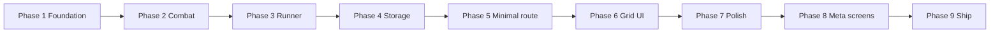

# BattleCode Simulation — Testable Implementation Phases

> **Companion docs:** [`ARCHITECTURE.md`](./ARCHITECTURE.md) · [`IMPLEMENTATION.md`](./IMPLEMENTATION.md)  
> **Branch:** `mini-game-gravitas`  
> **Rule:** Do not start phase N+1 until phase N exit criteria pass.

Each phase produces something you can **run and verify** before moving on. Phases are ordered by dependency — later phases assume earlier ones work.

---

## Phase overview

| Phase | Name                         | Runnable artifact            | Primary test              |
| ----- | ---------------------------- | ---------------------------- | ------------------------- |
| **1** | Engine foundation            | Pure functions               | Node/script assertions    |
| **2** | Combat & opponent AI         | Resolver + AI                | Scenario script           |
| **3** | Runner + sim config          | Full `step()` loop           | Programmatic playthrough  |
| **4** | localStorage cache           | Storage module               | Browser console / temp UI |
| **5** | Minimal `/simulations` route | Ugly but playable page       | Manual browser play       |
| **6** | Grid UI + HUD                | Visual board                 | Eyes + refresh resume     |
| **7** | Gameplay polish              | Beams, Monaco, opponent line | UX verification           |
| **8** | Meta screens                 | Tutorial, share, exhausted   | Full user journeys        |
| **9** | Site integration             | GA4, mobile gate, assets     | Cross-route QA            |

---

## Phase 1 — Engine foundation

### Goal

Types, grid helpers, and instruction parser — no combat yet.

### Files to create

```
src/game/engine/types.tsx
src/game/engine/constants.tsx
src/game/engine/grid.tsx
src/game/engine/parser.tsx
```

### Build

- Define all types from IMPLEMENTATION §13.
- `parseInstruction` strict-matches the 9 valid strings.
- `getCompletions(partial)` for later Monaco.
- Grid helpers: bounds, walkable, offset, manhattan.

### How to test

**Option A — temporary dev script** (quickest):

Create `src/game/engine/__dev__/phase1.test.tsx` (delete before ship):

```tsx
import { parseInstruction, getCompletions } from "../parser";
import { inBounds, isWalkable, offsetPosition } from "../grid";

const grid = [
  ["EMPTY", "WALL"],
  ["EMPTY", "EMPTY"],
] as const;

console.assert(parseInstruction("MOVE(UP)")?.type === "MOVE");
console.assert(parseInstruction("MOVE(UP) ")?.direction === "UP");
console.assert(parseInstruction("move(up)") === null);
console.assert(getCompletions("ATTACK(R").includes("ATTACK(RIGHT)"));
console.assert(isWalkable(grid as any, { row: 0, col: 0 }) === true);
console.assert(isWalkable(grid as any, { row: 0, col: 1 }) === false);
console.log("Phase 1 OK");
```

Run: `npx tsx src/game/engine/__dev__/phase1.test.tsx`

**Option B — add Vitest later in phase 1** if you prefer a test runner.

### Exit criteria

- [ ] All 9 instruction strings parse correctly
- [ ] Invalid strings return `null`
- [ ] Completion prefix filter works for `M`, `MOVE(`, `SHIELD(`
- [ ] Grid helpers handle OOB and walls

---

## Phase 2 — Combat & opponent AI

### Goal

Beam logic, simultaneous turn resolver, logical opponent.

### Files to create

```
src/game/engine/beam.tsx
src/game/engine/opponent.tsx
src/game/engine/resolver.tsx
```

### Build

- `getBeamCells` stops at walls, excludes self
- `resolveCycle`: shield → move → attack → cleanup → outcome
- Collision: same cell + swap → neither moves
- Mutual kill → player loss
- `chooseOpponentInstruction`: attack toward player if aligned, else move toward, stuck → `SHIELD()`

### How to test

Create `src/game/engine/__dev__/phase2.test.tsx`:

```tsx
import { createInitialState } from "../runner"; // stub runner or inline minimal state
import { resolveCycle } from "../resolver";
import { chooseOpponentInstruction } from "../opponent";
// Use a tiny 5x5 fixture inline or import from __fixtures__/tiny.tsx
```

**Minimum scenarios to assert:**

| #   | Scenario                                     | Expected                                           |
| --- | -------------------------------------------- | -------------------------------------------------- |
| 1   | Player `SHIELD()`, opponent `ATTACK` aligned | No player damage                                   |
| 2   | Player `ATTACK(RIGHT)` hits opponent         | Opponent lives 2→1                                 |
| 3   | Beam toward wall                             | No damage through wall                             |
| 4   | Both `MOVE` into same cell                   | Neither moves                                      |
| 5   | Opponent aligned with player                 | `chooseOpponentInstruction` → ATTACK toward player |
| 6   | Opponent not aligned                         | → MOVE toward player                               |
| 7   | Both die same cycle                          | outcome `loss`                                     |

Run with `npx tsx`.

### Exit criteria

- [ ] All 7 scenarios pass
- [ ] Opponent is deterministic (same state → same instruction)

---

## Phase 3 — Runner + simulation config

### Goal

Public engine API and the active simulation config.

### Files to create

```
src/game/engine/runner.tsx
src/game/engine/index.tsx
src/game/simulations/active.tsx
src/game/simulations/validate.tsx
src/game/simulations/index.tsx
src/game/engine/__fixtures__/tiny.tsx   # optional test map
```

### Build

- `createInitialState(config)` — cycle 0, 2 lives, spawns
- `step(state, playerInstruction, config)` — opponent AI + resolve
- `ACTIVE_SIMULATION` — start with a simple 5×5 map (few walls)
- `validateSimulationConfig` on import in dev

### How to test

`src/game/engine/__dev__/phase3.test.tsx`:

```tsx
import { ACTIVE_SIMULATION } from "../../simulations/active";
import { createInitialState, step } from "../runner";

let state = createInitialState(ACTIVE_SIMULATION);
const r1 = step(state, { type: "SHIELD" }, ACTIVE_SIMULATION);
// ... play N steps
// assert outcome or state fields
```

Also verify: `validateSimulationConfig(ACTIVE_SIMULATION)` throws on bad spawn.

### Exit criteria

- [ ] `step()` returns `StepResult` with opponent instruction + beam paths + outcome
- [ ] Can win or lose a full game programmatically on `ACTIVE_SIMULATION`
- [ ] Config validation catches invalid spawns

---

## Phase 4 — localStorage cache

### Goal

Per-simulation save files in localStorage.

### Files to create

```
src/game/storage/simulationStorage.tsx
src/game/engine/__dev__/phase4.html   # optional — or test in browser console on /simulations later
```

### Build

- `loadRoot`, `saveRoot`, `loadSimulation`, `saveSimulation`, `deleteSimulation`
- `createFreshSave(config)` — 2 attempts, `status: "playing"`
- `getTutorialDone`, `setTutorialDone`
- SSR guards (`typeof window`)

### How to test

**Browser console** (after temporary mount in phase 5, or paste in any page):

```js
// After importing from app, or use phase 5 page with a "Test storage" button
localStorage.removeItem("battlecode_sim_v1");
// createFreshSave → saveSimulation → loadSimulation → assert equal
// setTutorialDone(true) → reload → still true
// save under sim-001 and sim-002 → both exist in root.simulations
```

Or temporary button on a dev-only section calling storage functions and logging results.

### Exit criteria

- [ ] Fresh save has 2 attempts, playing status, correct spawns
- [ ] Save/load round-trip preserves cycle, bots, lives
- [ ] `tutorialDone` persists at root level
- [ ] Two sim IDs coexist in `simulations` map
- [ ] Corrupt/missing key → safe defaults

---

## Phase 5 — Minimal playable route

### Goal

End-to-end play in the browser with **plain text input** (no Monaco, no pretty grid yet).

### Files to create / modify

```
src/app/simulations/page.tsx
src/game/hooks/useSimulationGame.tsx
src/components/simulation/SimulationGame.tsx
src/components/simulation/SimulationLayout.tsx
src/components/simulation/TurnInputPlain.tsx   # temporary <input>, replaced in phase 7
src/components/simulation/LivesHud.tsx
src/components/simulation/AttemptsBadge.tsx
```

### Build

- Mount on `/simulations`
- Load/create save from storage on mount
- Show: cycle, lives, attempts, opponent last move (text only)
- Plain `<input>` + Submit — `parseInstruction`, `step`, persist after each cycle
- Win / loss / exhausted routing (simple text screens OK for now)
- Loss decrements attempts; retry resets run

### How to test

1. `npm run dev` → open `http://localhost:3000/simulations`
2. Play several cycles with valid instructions
3. **Refresh mid-game** → state resumes
4. Intentionally lose → attempts 2→1, retry works
5. Lose twice → exhausted screen (text OK)
6. Win → win screen (text OK)
7. Open DevTools → Application → localStorage → inspect `battlecode_sim_v1`

### Exit criteria

- [ ] Full game playable with plain input
- [ ] Invalid input rejected (no submit)
- [ ] Persistence + attempts rules match ARCHITECTURE
- [ ] No auth required

---

## Phase 6 — Grid UI + HUD

### Goal

Visual tactical grid replacing debug text positions.

### Files to create

```
src/components/simulation/GridBoard.tsx
src/components/simulation/GridCell.tsx
src/components/simulation/BotMarker.tsx
src/components/simulation/StaticCommander.tsx   # placeholder box OK
```

Modify `globals.css` — sim cell/bot base styles.

### Build

- CSS grid from `grid[row][col]`
- Player orange, opponent red, walls gray
- Shield ring on bot when `shieldActive`
- Hide bot at 0 lives
- Responsive cell sizing (mobile + desktop wireframes)

### How to test

1. Play on `/simulations` — bots move on board after each submit
2. Resize to mobile width — grid scales
3. Refresh — board matches saved positions
4. Place walls in config — render correctly

### Exit criteria

- [ ] Grid matches engine state every cycle
- [ ] Readable on mobile and desktop
- [ ] Commander placeholder visible (no dialogue)

---

## Phase 7 — Gameplay polish

### Goal

Monaco autocomplete input, beam animation, opponent move reveal.

### Files to create / modify

```
src/components/simulation/TurnInput.tsx          # replaces TurnInputPlain
src/components/simulation/instructionLanguage.tsx
src/components/simulation/BeamOverlay.tsx
src/components/simulation/OpponentMoveReveal.tsx
```

Delete `TurnInputPlain.tsx` when done.

Modify `globals.css` — beam + shield animations.

Modify `useSimulationGame` — `animating` phase; persist **after** animation completes.

### Build

- Monaco single-line, inline completions from `getCompletions`
- Tab / Enter to accept + submit
- Beam highlights path cells ~500ms then commit state
- Show `Opponent: ATTACK(LEFT)` after each cycle

### How to test

1. Type `MOV` → see inline suggestion → Tab → `MOVE(UP)` → Enter
2. Invalid partial cannot submit
3. `ATTACK` — beam flashes along row/col, stops at wall
4. Refresh **during** animation — on reload state matches post-animation (persist after animate)
5. Mobile keyboard + Enter submits valid line

### Exit criteria

- [ ] Autocomplete works desktop + mobile
- [ ] Beam animation visible and timed
- [ ] Opponent instruction shown each cycle
- [ ] No regression on phases 5–6 behavior

---

## Phase 8 — Meta screens

### Goal

Tutorial, share cards, exhausted view, win/loss polish.

### Files to create

```
src/components/simulation/TutorialOverlay.tsx
src/components/simulation/tutorialSteps.tsx
src/components/simulation/ShareCard.tsx
src/components/simulation/shareCanvas.tsx
src/components/simulation/ExhaustedView.tsx
```

Wire into `SimulationGame` phase machine.

### Build

- Tutorial on first visit (`!tutorialDone`), skippable
- Win share: canvas 1080×1920, download + Web Share
- Loss share: generic copy
- Exhausted: share only + `nextSimulationDate`
- Retry button on loss when attempts remain

### How to test

| Journey      | Steps                                                                    |
| ------------ | ------------------------------------------------------------------------ |
| Tutorial     | Clear localStorage → tutorial shows → skip → does not reappear on reload |
| Win          | Beat sim → win card → download PNG → share (mobile if available)         |
| Loss + retry | Lose → loss card → retry → fresh board, attempts decremented             |
| Exhausted    | Lose twice → no retry → next date shown                                  |

### Exit criteria

- [ ] All four journeys work
- [ ] Share PNG includes logo area, headline, event date
- [ ] Tutorial skip/complete sets `tutorialDone`

---

## Phase 9 — Site integration & ship

### Goal

GA4, mobile gate, final content, cleanup.

### Files to create / modify

```
src/lib/analytics.tsx
src/app/layout.tsx                    # GA4 scripts
src/components/MobileOnly.tsx         # allow / and /simulations
public/simulation/battlecode-logo.png
public/simulation/commander-placeholder.svg
src/game/simulations/active.tsx       # final map design
```

Delete `src/game/engine/__dev__/**` test scripts.

### Build

- `trackEvent` wrapper + sim events from ARCHITECTURE §16
- MobileOnly pathname allowlist
- Final `ACTIVE_SIMULATION` map tuned with `maxCycles`
- Remove dev-only UI/buttons

### How to test

- [ ] GA4 DebugView receives `sim_page_view`, `sim_win`, etc.
- [ ] `/simulations` works on mobile UA
- [ ] `/dashboard` still blocked on mobile
- [ ] `/` still works on mobile
- [ ] `npm run build` passes
- [ ] Manual QA checklist from ARCHITECTURE §20

### Exit criteria

- [ ] Production build succeeds
- [ ] Definition of Done in IMPLEMENTATION §17 complete

---

## Suggested workflow per phase

```bash
# 1. Implement phase files
# 2. Run phase test (tsx script or browser)
# 3. Commit on mini-game-gravitas with message: "sim phase N: <name>"
# 4. Only then start phase N+1
```

### Commit message pattern

```
sim phase 1: engine foundation (types, grid, parser)
sim phase 2: combat resolver and opponent AI
...
```

---

## What to build first (Phase 1 checklist)

When you say go, implementation starts here:

1. `src/game/engine/types.tsx`
2. `src/game/engine/constants.tsx`
3. `src/game/engine/grid.tsx`
4. `src/game/engine/parser.tsx`
5. `src/game/engine/__dev__/phase1.test.tsx`
6. Run `npx tsx src/game/engine/__dev__/phase1.test.tsx` → `Phase 1 OK`

---

## Phase dependency graph



Phases 1–3 need **no browser**. Phase 4 needs a browser for localStorage. Phases 5+ are full UI.

---

_Start with Phase 1 when ready._
